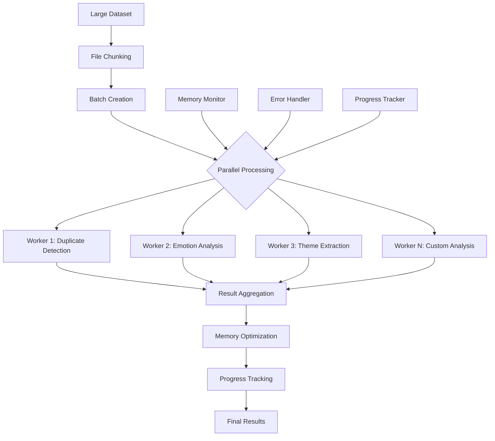

# Batch Processor Documentation

## Overview

The `BatchProcessor` class provides efficient processing capabilities for large-scale comment analysis in the Personal Paraguay Fiber Comments Analysis system. It implements memory optimization, parallel processing, and chunked data handling to manage datasets that exceed available system memory.

---

## Architecture

### Class Structure

```python
class BatchProcessor:
    """Batch processing tool for efficient large-scale analysis"""
    
    def __init__(self, batch_size: int = 1000, n_workers: int = None):
        self.batch_size = batch_size
        self.n_workers = n_workers or min(4, mp.cpu_count())
        
        # Initialize analyzers
        self.duplicate_cleaner = DuplicateCleaner()
        self.emotion_analyzer = EmotionAnalyzer()
        self.theme_analyzer = ThemeAnalyzer()
        
        # Processing statistics
        self.processing_stats = {
            'total_processed': 0,
            'batches_completed': 0,
            'processing_time': 0,
            'memory_usage': []
        }
```

### Processing Pipeline



---

## Core Features

### 1. Memory-Efficient File Reading

```python
def read_file_in_chunks(self, file_path: str, 
                       chunk_size: int = None) -> Generator[pd.DataFrame, None, None]:
    """
    Read large file in chunks for memory efficiency
    
    Args:
        file_path: Path to input file
        chunk_size: Size of each chunk
        
    Yields:
        DataFrame chunks
    """
    chunk_size = chunk_size or self.batch_size
    file_extension = Path(file_path).suffix.lower()
    
    try:
        if file_extension == '.csv':
            # Use pandas chunking for CSV files
            for chunk in pd.read_csv(file_path, chunksize=chunk_size):
                yield chunk
                
        elif file_extension in ['.xlsx', '.xls']:
            # Manual chunking for Excel files
            df = pd.read_excel(file_path)
            for i in range(0, len(df), chunk_size):
                yield df.iloc[i:i + chunk_size]
                
        else:
            raise ValueError(f"Unsupported file format: {file_extension}")
            
    except Exception as e:
        logger.error(f"Error reading file: {e}")
        raise
```

**Features:**
- **Automatic Format Detection**: Supports CSV and Excel files
- **Dynamic Chunk Sizing**: Adapts to available memory
- **Generator Pattern**: Memory-efficient iteration
- **Error Recovery**: Graceful handling of read failures

### 2. Batch Processing Engine

```python
def process_batch(self, batch_df: pd.DataFrame, 
                 batch_id: int,
                 analyses: List[str] = None) -> Dict:
    """
    Process a single batch of data
    
    Args:
        batch_df: DataFrame batch to process
        batch_id: Batch identifier
        analyses: List of analyses to perform
        
    Returns:
        Dictionary with batch results
    """
    if analyses is None:
        analyses = ['duplicates', 'emotions', 'themes']
    
    batch_results = {
        'batch_id': batch_id,
        'size': len(batch_df),
        'timestamp': datetime.now(),
        'results': {}
    }
    
    try:
        # Track memory before processing
        memory_before = self._get_memory_usage()
        
        # Process each analysis type
        for analysis in analyses:
            if analysis == 'duplicates':
                batch_results['results']['duplicates'] = self._process_duplicates(batch_df)
            elif analysis == 'emotions':
                batch_results['results']['emotions'] = self._process_emotions(batch_df)
            elif analysis == 'themes':
                batch_results['results']['themes'] = self._process_themes(batch_df)
        
        # Track memory after processing
        memory_after = self._get_memory_usage()
        batch_results['memory_delta'] = memory_after - memory_before
        
        # Force garbage collection
        gc.collect()
        
        return batch_results
        
    except Exception as e:
        logger.error(f"Batch {batch_id} processing failed: {e}")
        batch_results['error'] = str(e)
        return batch_results
```

**Batch Processing Features:**
- **Modular Analysis**: Select specific analyses per batch
- **Memory Tracking**: Monitor memory usage per batch
- **Error Isolation**: Batch failures don't affect other batches
- **Automatic Cleanup**: Garbage collection after each batch

### 3. Parallel Processing

```python
def process_parallel(self, data_source, 
                    analyses: List[str] = None,
                    progress_callback: callable = None) -> Dict:
    """
    Process data in parallel across multiple workers
    
    Args:
        data_source: File path or DataFrame
        analyses: List of analyses to perform
        progress_callback: Function to call with progress updates
        
    Returns:
        Aggregated results from all batches
    """
    
    # Determine data source type
    if isinstance(data_source, str):
        # File path - use chunked reading
        data_iterator = self.read_file_in_chunks(data_source)
    elif isinstance(data_source, pd.DataFrame):
        # DataFrame - create manual chunks
        data_iterator = self._create_dataframe_chunks(data_source)
    else:
        raise ValueError("data_source must be file path or DataFrame")
    
    # Initialize results aggregator
    aggregator = ResultsAggregator()
    
    # Process with ThreadPoolExecutor for I/O bound tasks
    with ThreadPoolExecutor(max_workers=self.n_workers) as executor:
        # Submit all batches for processing
        future_to_batch = {}
        batch_id = 0
        
        for chunk in data_iterator:
            future = executor.submit(self.process_batch, chunk, batch_id, analyses)
            future_to_batch[future] = batch_id
            batch_id += 1
        
        # Collect results as they complete
        completed_batches = 0
        total_batches = len(future_to_batch)
        
        for future in concurrent.futures.as_completed(future_to_batch):
            batch_id = future_to_batch[future]
            
            try:
                batch_result = future.result()
                aggregator.add_batch_result(batch_result)
                completed_batches += 1
                
                # Progress callback
                if progress_callback:
                    progress = completed_batches / total_batches
                    progress_callback(progress, batch_id, batch_result)
                    
            except Exception as e:
                logger.error(f"Batch {batch_id} failed: {e}")
                aggregator.add_error(batch_id, str(e))
    
    # Return aggregated results
    return aggregator.get_final_results()
```

**Parallel Processing Features:**
- **Thread Pool Execution**: Efficient for I/O-bound analysis tasks
- **Dynamic Load Balancing**: Automatic work distribution
- **Progress Tracking**: Real-time progress updates
- **Error Aggregation**: Collect and report all processing errors

### 4. Memory Optimization

```python
class MemoryManager:
    """Manages memory usage during batch processing"""
    
    def __init__(self, max_memory_mb: int = 2048):
        self.max_memory_mb = max_memory_mb
        self.memory_samples = []
        self.gc_threshold = 0.8  # Trigger GC at 80% memory usage
    
    def check_memory_usage(self) -> Dict[str, float]:
        """Check current memory usage"""
        import psutil
        
        process = psutil.Process()
        memory_info = process.memory_info()
        
        current_mb = memory_info.rss / 1024 / 1024
        percentage = (current_mb / self.max_memory_mb) * 100
        
        self.memory_samples.append({
            'timestamp': datetime.now(),
            'memory_mb': current_mb,
            'percentage': percentage
        })
        
        return {
            'current_mb': current_mb,
            'max_mb': self.max_memory_mb,
            'percentage': percentage,
            'should_gc': percentage > (self.gc_threshold * 100)
        }
    
    def optimize_batch_size(self, current_batch_size: int, 
                          memory_usage: float) -> int:
        """Dynamically adjust batch size based on memory usage"""
        
        if memory_usage > 90:
            # High memory usage - reduce batch size significantly
            return max(10, current_batch_size // 4)
        elif memory_usage > 70:
            # Moderate memory usage - reduce batch size
            return max(50, current_batch_size // 2)
        elif memory_usage < 30:
            # Low memory usage - can increase batch size
            return min(2000, current_batch_size * 2)
        else:
            # Optimal memory usage - keep current size
            return current_batch_size
    
    def force_cleanup(self):
        """Force memory cleanup"""
        gc.collect()
        
        # Clear any cached data structures
        if hasattr(self, '_cache'):
            self._cache.clear()
```

**Memory Management Features:**
- **Real-time Monitoring**: Track memory usage during processing
- **Dynamic Batch Sizing**: Adjust batch sizes based on memory pressure
- **Automatic Cleanup**: Trigger garbage collection when needed
- **Memory Profiling**: Detailed memory usage statistics

### 5. Progress Tracking and Monitoring

```python
class ProgressTracker:
    """Tracks and reports processing progress"""
    
    def __init__(self, total_items: int):
        self.total_items = total_items
        self.processed_items = 0
        self.start_time = datetime.now()
        self.batch_times = []
        self.error_count = 0
    
    def update(self, items_processed: int, batch_time: float = None):
        """Update progress with newly processed items"""
        self.processed_items += items_processed
        
        if batch_time:
            self.batch_times.append(batch_time)
    
    def get_progress_info(self) -> Dict:
        """Get current progress information"""
        elapsed = (datetime.now() - self.start_time).total_seconds()
        percentage = (self.processed_items / self.total_items) * 100
        
        # Calculate ETA
        if self.processed_items > 0:
            rate = self.processed_items / elapsed
            remaining_items = self.total_items - self.processed_items
            eta_seconds = remaining_items / rate if rate > 0 else 0
        else:
            eta_seconds = 0
        
        # Calculate average batch time
        avg_batch_time = np.mean(self.batch_times) if self.batch_times else 0
        
        return {
            'percentage': percentage,
            'processed': self.processed_items,
            'total': self.total_items,
            'elapsed_seconds': elapsed,
            'eta_seconds': eta_seconds,
            'items_per_second': self.processed_items / elapsed if elapsed > 0 else 0,
            'avg_batch_time': avg_batch_time,
            'error_count': self.error_count
        }
    
    def format_progress_message(self) -> str:
        """Format progress as human-readable message"""
        info = self.get_progress_info()
        
        eta_formatted = self._format_duration(info['eta_seconds'])
        elapsed_formatted = self._format_duration(info['elapsed_seconds'])
        
        return (f"Progress: {info['percentage']:.1f}% "
                f"({info['processed']:,}/{info['total']:,}) | "
                f"Elapsed: {elapsed_formatted} | "
                f"ETA: {eta_formatted} | "
                f"Rate: {info['items_per_second']:.1f} items/sec")
    
    def _format_duration(self, seconds: float) -> str:
        """Format duration in human-readable format"""
        if seconds < 60:
            return f"{seconds:.0f}s"
        elif seconds < 3600:
            return f"{seconds/60:.0f}m {seconds%60:.0f}s"
        else:
            hours = seconds // 3600
            minutes = (seconds % 3600) // 60
            return f"{hours:.0f}h {minutes:.0f}m"
```

---

## Analysis Integration

### 1. Duplicate Detection in Batches

```python
def _process_duplicates(self, batch_df: pd.DataFrame) -> Dict:
    """Process duplicate detection for a batch"""
    
    try:
        # Find duplicates within this batch
        batch_duplicates = self.duplicate_cleaner.find_exact_duplicates(batch_df)
        
        # Track global duplicates across batches
        global_hashes = getattr(self, '_global_hashes', set())
        
        # Check for duplicates against global set
        cross_batch_duplicates = []
        for _, row in batch_df.iterrows():
            text_hash = self.duplicate_cleaner.generate_hash(row.get('Comentario Final', ''))
            if text_hash in global_hashes:
                cross_batch_duplicates.append(row.to_dict())
            else:
                global_hashes.add(text_hash)
        
        # Update global hash set
        self._global_hashes = global_hashes
        
        return {
            'batch_duplicates': len(batch_duplicates),
            'cross_batch_duplicates': len(cross_batch_duplicates),
            'unique_comments': len(batch_df) - len(batch_duplicates),
            'duplicate_examples': batch_duplicates[:3]  # First 3 examples
        }
        
    except Exception as e:
        logger.error(f"Duplicate processing failed: {e}")
        return {'error': str(e)}
```

### 2. Emotion Analysis in Batches

```python
def _process_emotions(self, batch_df: pd.DataFrame) -> Dict:
    """Process emotion analysis for a batch"""
    
    try:
        emotion_results = []
        text_column = 'Comentario Final'
        
        for _, row in batch_df.iterrows():
            comment_text = row.get(text_column, '')
            
            if pd.notna(comment_text) and len(str(comment_text).strip()) > 0:
                emotions = self.emotion_analyzer.analyze_emotions(str(comment_text))
                emotion_results.append(emotions)
            else:
                # Handle empty/null comments
                emotion_results.append({
                    'joy': 0, 'anger': 0, 'sadness': 0, 
                    'fear': 0, 'surprise': 0, 'disgust': 0
                })
        
        # Convert to DataFrame for easier aggregation
        emotions_df = pd.DataFrame(emotion_results)
        
        return {
            'batch_size': len(batch_df),
            'valid_comments': len([r for r in emotion_results if sum(r.values()) > 0]),
            'emotion_averages': emotions_df.mean().to_dict(),
            'dominant_emotions': emotions_df.idxmax(axis=1).value_counts().to_dict(),
            'high_intensity_count': len(emotions_df[emotions_df.sum(axis=1) > 0.7])
        }
        
    except Exception as e:
        logger.error(f"Emotion processing failed: {e}")
        return {'error': str(e)}
```

### 3. Theme Analysis in Batches

```python
def _process_themes(self, batch_df: pd.DataFrame) -> Dict:
    """Process theme analysis for a batch"""
    
    try:
        text_column = 'Comentario Final'
        comments = batch_df[text_column].dropna().astype(str).tolist()
        
        if not comments:
            return {'error': 'No valid comments for theme analysis'}
        
        # Extract themes from this batch
        batch_themes = self.theme_analyzer.extract_themes(comments)
        
        # Update global theme tracking
        if not hasattr(self, '_global_themes'):
            self._global_themes = {}
        
        # Merge with global themes
        for theme, frequency in batch_themes.items():
            self._global_themes[theme] = self._global_themes.get(theme, 0) + frequency
        
        return {
            'batch_themes_count': len(batch_themes),
            'top_batch_themes': dict(sorted(batch_themes.items(), 
                                          key=lambda x: x[1], 
                                          reverse=True)[:10]),
            'total_theme_mentions': sum(batch_themes.values()),
            'average_themes_per_comment': len(batch_themes) / len(comments) if comments else 0
        }
        
    except Exception as e:
        logger.error(f"Theme processing failed: {e}")
        return {'error': str(e)}
```

---

## Results Aggregation

### Results Aggregator Class

```python
class ResultsAggregator:
    """Aggregates results from multiple batch processing operations"""
    
    def __init__(self):
        self.batch_results = []
        self.errors = {}
        self.aggregated_stats = {
            'total_processed': 0,
            'total_batches': 0,
            'processing_time': 0,
            'error_count': 0
        }
    
    def add_batch_result(self, batch_result: Dict):
        """Add result from a processed batch"""
        self.batch_results.append(batch_result)
        self.aggregated_stats['total_processed'] += batch_result.get('size', 0)
        self.aggregated_stats['total_batches'] += 1
    
    def add_error(self, batch_id: int, error_message: str):
        """Add error from a failed batch"""
        self.errors[batch_id] = error_message
        self.aggregated_stats['error_count'] += 1
    
    def get_final_results(self) -> Dict:
        """Get final aggregated results"""
        
        # Aggregate duplicate results
        duplicate_stats = self._aggregate_duplicates()
        
        # Aggregate emotion results
        emotion_stats = self._aggregate_emotions()
        
        # Aggregate theme results
        theme_stats = self._aggregate_themes()
        
        # Calculate performance metrics
        performance_stats = self._calculate_performance()
        
        return {
            'summary': self.aggregated_stats,
            'duplicates': duplicate_stats,
            'emotions': emotion_stats,
            'themes': theme_stats,
            'performance': performance_stats,
            'errors': self.errors
        }
    
    def _aggregate_duplicates(self) -> Dict:
        """Aggregate duplicate detection results"""
        total_duplicates = 0
        total_unique = 0
        
        for batch in self.batch_results:
            if 'duplicates' in batch.get('results', {}):
                dup_result = batch['results']['duplicates']
                total_duplicates += dup_result.get('batch_duplicates', 0)
                total_unique += dup_result.get('unique_comments', 0)
        
        total_comments = total_duplicates + total_unique
        duplicate_percentage = (total_duplicates / total_comments * 100) if total_comments > 0 else 0
        
        return {
            'total_duplicates': total_duplicates,
            'total_unique': total_unique,
            'duplicate_percentage': duplicate_percentage,
            'reduction_achieved': total_duplicates
        }
    
    def _aggregate_emotions(self) -> Dict:
        """Aggregate emotion analysis results"""
        all_emotions = {}
        total_valid_comments = 0
        all_dominant_emotions = {}
        
        for batch in self.batch_results:
            if 'emotions' in batch.get('results', {}):
                emotion_result = batch['results']['emotions']
                
                # Aggregate emotion averages (weighted by batch size)
                batch_size = emotion_result.get('valid_comments', 0)
                if batch_size > 0:
                    emotion_avgs = emotion_result.get('emotion_averages', {})
                    for emotion, avg in emotion_avgs.items():
                        if emotion not in all_emotions:
                            all_emotions[emotion] = []
                        all_emotions[emotion].append((avg, batch_size))
                    
                    total_valid_comments += batch_size
                
                # Aggregate dominant emotions
                dominant = emotion_result.get('dominant_emotions', {})
                for emotion, count in dominant.items():
                    all_dominant_emotions[emotion] = all_dominant_emotions.get(emotion, 0) + count
        
        # Calculate weighted averages
        final_emotions = {}
        for emotion, values in all_emotions.items():
            weighted_sum = sum(avg * size for avg, size in values)
            final_emotions[emotion] = weighted_sum / total_valid_comments if total_valid_comments > 0 else 0
        
        return {
            'emotion_distribution': final_emotions,
            'dominant_emotion_counts': all_dominant_emotions,
            'most_common_emotion': max(all_dominant_emotions.items(), key=lambda x: x[1])[0] if all_dominant_emotions else None,
            'total_analyzed_comments': total_valid_comments
        }
    
    def _aggregate_themes(self) -> Dict:
        """Aggregate theme analysis results"""
        all_themes = {}
        total_theme_mentions = 0
        
        for batch in self.batch_results:
            if 'themes' in batch.get('results', {}):
                theme_result = batch['results']['themes']
                
                # Aggregate themes
                batch_themes = theme_result.get('top_batch_themes', {})
                for theme, frequency in batch_themes.items():
                    all_themes[theme] = all_themes.get(theme, 0) + frequency
                
                total_theme_mentions += theme_result.get('total_theme_mentions', 0)
        
        # Sort themes by frequency
        sorted_themes = sorted(all_themes.items(), key=lambda x: x[1], reverse=True)
        
        return {
            'total_themes': len(all_themes),
            'top_themes': dict(sorted_themes[:20]),  # Top 20 themes
            'total_theme_mentions': total_theme_mentions,
            'average_themes_per_comment': len(all_themes) / self.aggregated_stats['total_processed'] if self.aggregated_stats['total_processed'] > 0 else 0
        }
    
    def _calculate_performance(self) -> Dict:
        """Calculate overall performance metrics"""
        
        if not self.batch_results:
            return {}
        
        # Calculate processing times
        total_time = sum(batch.get('processing_time', 0) for batch in self.batch_results)
        avg_batch_time = total_time / len(self.batch_results) if self.batch_results else 0
        
        # Calculate memory usage
        memory_deltas = [batch.get('memory_delta', 0) for batch in self.batch_results if 'memory_delta' in batch]
        avg_memory_delta = np.mean(memory_deltas) if memory_deltas else 0
        max_memory_delta = max(memory_deltas) if memory_deltas else 0
        
        # Calculate throughput
        items_per_second = self.aggregated_stats['total_processed'] / total_time if total_time > 0 else 0
        
        return {
            'total_processing_time': total_time,
            'average_batch_time': avg_batch_time,
            'items_per_second': items_per_second,
            'average_memory_delta_mb': avg_memory_delta,
            'max_memory_delta_mb': max_memory_delta,
            'success_rate': (len(self.batch_results) / (len(self.batch_results) + len(self.errors))) * 100 if (len(self.batch_results) + len(self.errors)) > 0 else 0
        }
```

---

## Configuration and Optimization

### Batch Size Optimization

```python
def optimize_batch_size(self, dataset_size: int, available_memory_mb: int) -> int:
    """
    Calculate optimal batch size based on dataset size and available memory
    
    Args:
        dataset_size: Total number of records
        available_memory_mb: Available memory in MB
        
    Returns:
        Optimal batch size
    """
    
    # Base calculations
    base_batch_size = 100
    memory_per_record_mb = 0.001  # Estimated memory per record
    
    # Memory-based calculation
    max_batch_by_memory = int(available_memory_mb * 0.3 / memory_per_record_mb)  # Use 30% of available memory
    
    # Dataset-based calculation
    if dataset_size < 1000:
        optimal_batch = min(100, dataset_size)
    elif dataset_size < 10000:
        optimal_batch = min(500, dataset_size // 10)
    elif dataset_size < 100000:
        optimal_batch = min(1000, dataset_size // 50)
    else:
        optimal_batch = min(2000, dataset_size // 100)
    
    # Return the minimum to ensure we don't exceed memory limits
    return min(max_batch_by_memory, optimal_batch, 2000)

def get_processing_configuration(self, dataset_info: Dict) -> Dict:
    """
    Get optimized processing configuration based on dataset characteristics
    
    Args:
        dataset_info: Dictionary with dataset information
        
    Returns:
        Optimized configuration
    """
    
    size = dataset_info.get('size', 0)
    memory_available = dataset_info.get('memory_mb', 2048)
    cpu_cores = dataset_info.get('cpu_cores', mp.cpu_count())
    
    # Optimize batch size
    batch_size = self.optimize_batch_size(size, memory_available)
    
    # Optimize worker count
    if size < 1000:
        workers = 1  # Single worker for small datasets
    elif size < 10000:
        workers = min(2, cpu_cores)
    else:
        workers = min(4, cpu_cores)
    
    # Select analyses based on dataset size
    if size < 500:
        analyses = ['duplicates', 'emotions', 'themes']
    elif size < 5000:
        analyses = ['duplicates', 'emotions']  # Skip themes for medium datasets
    else:
        analyses = ['duplicates']  # Only duplicates for large datasets
    
    return {
        'batch_size': batch_size,
        'n_workers': workers,
        'analyses': analyses,
        'memory_limit_mb': memory_available * 0.8,  # Use 80% of available memory
        'enable_progress_tracking': size > 1000,
        'enable_memory_monitoring': size > 5000
    }
```

---

## Error Handling and Recovery

### Batch-Level Error Recovery

```python
def process_with_recovery(self, data_source, analyses: List[str] = None) -> Dict:
    """
    Process data with automatic error recovery and retry logic
    
    Args:
        data_source: File path or DataFrame
        analyses: List of analyses to perform
        
    Returns:
        Results with recovery information
    """
    
    max_retries = 3
    failed_batches = []
    recovery_results = []
    
    # First attempt - normal processing
    try:
        results = self.process_parallel(data_source, analyses)
        if results.get('errors'):
            failed_batches = list(results['errors'].keys())
        else:
            return results
    except Exception as e:
        logger.error(f"Initial processing failed: {e}")
        failed_batches = ['all']
    
    # Recovery attempts
    for attempt in range(max_retries):
        if not failed_batches:
            break
            
        logger.info(f"Recovery attempt {attempt + 1} for {len(failed_batches)} failed batches")
        
        # Reduce batch size for recovery
        original_batch_size = self.batch_size
        self.batch_size = max(10, self.batch_size // (2 ** (attempt + 1)))
        
        # Retry failed batches
        retry_results = []
        remaining_failures = []
        
        for batch_id in failed_batches:
            try:
                # Get the specific batch data that failed
                batch_data = self._get_batch_data(data_source, batch_id)
                
                # Process with reduced complexity
                simplified_analyses = ['duplicates']  # Only essential analysis
                batch_result = self.process_batch(batch_data, batch_id, simplified_analyses)
                
                if 'error' not in batch_result:
                    retry_results.append(batch_result)
                else:
                    remaining_failures.append(batch_id)
                    
            except Exception as e:
                logger.error(f"Recovery failed for batch {batch_id}: {e}")
                remaining_failures.append(batch_id)
        
        # Update failed batches list
        failed_batches = remaining_failures
        recovery_results.extend(retry_results)
        
        # Restore original batch size
        self.batch_size = original_batch_size
    
    # Compile final results
    if recovery_results:
        # Merge recovery results with original results
        aggregator = ResultsAggregator()
        for result in recovery_results:
            aggregator.add_batch_result(result)
        
        return {
            'status': 'partial_success',
            'recovery_attempts': max_retries,
            'recovered_batches': len(recovery_results),
            'final_failures': len(failed_batches),
            'results': aggregator.get_final_results()
        }
    else:
        return {
            'status': 'failed',
            'error': 'All recovery attempts failed',
            'failed_batches': failed_batches
        }
```

### Memory Overflow Recovery

```python
def handle_memory_overflow(self, current_batch_size: int) -> int:
    """
    Handle memory overflow by reducing batch size and triggering cleanup
    
    Args:
        current_batch_size: Current batch size that caused overflow
        
    Returns:
        New batch size to prevent overflow
    """
    
    logger.warning("Memory overflow detected, implementing recovery measures")
    
    # Force garbage collection
    gc.collect()
    
    # Clear any cached data
    self._clear_caches()
    
    # Reduce batch size significantly
    new_batch_size = max(10, current_batch_size // 4)
    
    # Reduce worker count to prevent concurrent memory usage
    original_workers = self.n_workers
    self.n_workers = 1
    
    logger.info(f"Reduced batch size from {current_batch_size} to {new_batch_size}")
    logger.info(f"Reduced workers from {original_workers} to {self.n_workers}")
    
    return new_batch_size

def _clear_caches(self):
    """Clear all internal caches to free memory"""
    
    # Clear analyzer caches
    if hasattr(self.duplicate_cleaner, '_cache'):
        self.duplicate_cleaner._cache.clear()
    
    if hasattr(self.emotion_analyzer, '_cache'):
        self.emotion_analyzer._cache.clear()
    
    if hasattr(self.theme_analyzer, '_cache'):
        self.theme_analyzer._cache.clear()
    
    # Clear global tracking variables
    if hasattr(self, '_global_hashes'):
        delattr(self, '_global_hashes')
    
    if hasattr(self, '_global_themes'):
        delattr(self, '_global_themes')
    
    # Clear results storage
    self.batch_results = []
    
    logger.info("Cleared all caches and temporary data")
```

---

## Performance Monitoring

### Real-time Performance Metrics

```python
class PerformanceMonitor:
    """Monitor batch processing performance in real-time"""
    
    def __init__(self):
        self.metrics = {
            'start_time': None,
            'batch_times': [],
            'memory_samples': [],
            'throughput_samples': [],
            'error_counts': {},
            'cpu_usage': []
        }
    
    def start_monitoring(self):
        """Start performance monitoring"""
        self.metrics['start_time'] = time.time()
        
        # Start background monitoring thread
        self.monitoring_thread = threading.Thread(target=self._monitor_resources)
        self.monitoring_thread.daemon = True
        self.monitoring_thread.start()
    
    def record_batch_completion(self, batch_size: int, processing_time: float):
        """Record completion of a batch"""
        self.metrics['batch_times'].append(processing_time)
        
        # Calculate throughput
        throughput = batch_size / processing_time if processing_time > 0 else 0
        self.metrics['throughput_samples'].append(throughput)
    
    def record_error(self, error_type: str):
        """Record an error occurrence"""
        self.metrics['error_counts'][error_type] = self.metrics['error_counts'].get(error_type, 0) + 1
    
    def get_current_metrics(self) -> Dict:
        """Get current performance metrics"""
        
        if not self.metrics['start_time']:
            return {}
        
        elapsed = time.time() - self.metrics['start_time']
        
        # Calculate averages
        avg_batch_time = np.mean(self.metrics['batch_times']) if self.metrics['batch_times'] else 0
        avg_throughput = np.mean(self.metrics['throughput_samples']) if self.metrics['throughput_samples'] else 0
        avg_memory = np.mean(self.metrics['memory_samples']) if self.metrics['memory_samples'] else 0
        avg_cpu = np.mean(self.metrics['cpu_usage']) if self.metrics['cpu_usage'] else 0
        
        return {
            'elapsed_time': elapsed,
            'total_batches': len(self.metrics['batch_times']),
            'average_batch_time': avg_batch_time,
            'average_throughput': avg_throughput,
            'average_memory_mb': avg_memory,
            'average_cpu_percent': avg_cpu,
            'total_errors': sum(self.metrics['error_counts'].values()),
            'error_breakdown': self.metrics['error_counts']
        }
    
    def _monitor_resources(self):
        """Background thread to monitor system resources"""
        import psutil
        
        while True:
            try:
                # Monitor memory
                process = psutil.Process()
                memory_mb = process.memory_info().rss / 1024 / 1024
                self.metrics['memory_samples'].append(memory_mb)
                
                # Monitor CPU
                cpu_percent = process.cpu_percent()
                self.metrics['cpu_usage'].append(cpu_percent)
                
                # Keep only recent samples (last 100)
                if len(self.metrics['memory_samples']) > 100:
                    self.metrics['memory_samples'] = self.metrics['memory_samples'][-100:]
                
                if len(self.metrics['cpu_usage']) > 100:
                    self.metrics['cpu_usage'] = self.metrics['cpu_usage'][-100:]
                
                time.sleep(1)  # Sample every second
                
            except Exception as e:
                logger.error(f"Resource monitoring error: {e}")
                break
```

---

## Integration Examples

### Streamlit Integration

```python
def render_batch_processing_ui(self):
    """Render batch processing interface in Streamlit"""
    
    st.title("🚀 Batch Processing")
    
    # Configuration section
    st.subheader("Configuration")
    col1, col2, col3 = st.columns(3)
    
    with col1:
        batch_size = st.slider("Batch Size", 10, 2000, self.batch_size)
    
    with col2:
        n_workers = st.slider("Workers", 1, mp.cpu_count(), self.n_workers)
    
    with col3:
        analyses = st.multiselect(
            "Analyses",
            ['duplicates', 'emotions', 'themes'],
            default=['duplicates', 'emotions']
        )
    
    # Update configuration
    self.batch_size = batch_size
    self.n_workers = n_workers
    
    # File processing section
    if st.button("🎯 Start Batch Processing", type="primary"):
        if 'uploaded_df' in st.session_state:
            
            # Create progress containers
            progress_bar = st.progress(0)
            status_text = st.empty()
            metrics_container = st.empty()
            
            # Progress callback function
            def update_progress(progress, batch_id, batch_result):
                progress_bar.progress(progress)
                status_text.text(f"Processing batch {batch_id}... ({progress*100:.1f}% complete)")
                
                # Update metrics
                if batch_result and 'results' in batch_result:
                    with metrics_container.container():
                        col1, col2, col3 = st.columns(3)
                        with col1:
                            st.metric("Batches Completed", batch_id + 1)
                        with col2:
                            st.metric("Items Processed", batch_result.get('size', 0))
                        with col3:
                            if 'duplicates' in batch_result['results']:
                                dup_count = batch_result['results']['duplicates'].get('batch_duplicates', 0)
                                st.metric("Duplicates Found", dup_count)
            
            # Run processing
            try:
                results = self.process_parallel(
                    st.session_state.uploaded_df,
                    analyses,
                    progress_callback=update_progress
                )
                
                progress_bar.progress(1.0)
                status_text.text("✅ Batch processing completed!")
                
                # Display results
                self._display_batch_results(results)
                
            except Exception as e:
                st.error(f"Batch processing failed: {str(e)}")
        
        else:
            st.error("Please upload a file first!")
```

### API Integration

```python
def create_batch_processing_api():
    """Create API endpoint for batch processing"""
    
    from flask import Flask, request, jsonify
    
    app = Flask(__name__)
    processor = BatchProcessor()
    
    @app.route('/api/batch/process', methods=['POST'])
    def process_batch_api():
        """API endpoint for batch processing"""
        
        try:
            # Parse request
            data = request.get_json()
            
            # Validate required fields
            if 'file_path' not in data:
                return jsonify({'error': 'file_path is required'}), 400
            
            # Extract parameters
            file_path = data['file_path']
            analyses = data.get('analyses', ['duplicates', 'emotions'])
            batch_size = data.get('batch_size', 100)
            n_workers = data.get('n_workers', 2)
            
            # Configure processor
            processor.batch_size = batch_size
            processor.n_workers = n_workers
            
            # Process file
            results = processor.process_parallel(file_path, analyses)
            
            return jsonify({
                'status': 'success',
                'results': results,
                'performance': processor.get_performance_metrics()
            })
            
        except Exception as e:
            return jsonify({
                'status': 'error',
                'error': str(e)
            }), 500
    
    @app.route('/api/batch/status/<job_id>', methods=['GET'])
    def get_batch_status(job_id):
        """Get status of batch processing job"""
        
        # Implementation for job status tracking
        # This would require a job queue system like Celery
        pass
    
    return app
```

---

## Best Practices

### 1. Memory Management
- Monitor memory usage continuously during processing
- Use dynamic batch sizing based on available memory
- Implement garbage collection at regular intervals
- Clear caches and temporary data between batches

### 2. Error Handling
- Implement retry logic for transient failures
- Isolate batch failures to prevent cascading errors
- Provide detailed error logging for debugging
- Use fallback methods for critical failures

### 3. Performance Optimization
- Choose optimal batch sizes based on dataset characteristics
- Use parallel processing for independent operations
- Implement progress tracking for long-running operations
- Cache frequently used data structures

### 4. Data Quality
- Validate data format before processing
- Handle missing or corrupted data gracefully
- Maintain data integrity across batch boundaries
- Track processing statistics for quality assurance

### 5. Scalability
- Design for horizontal scaling across multiple machines
- Use efficient data serialization formats
- Implement load balancing for distributed processing
- Monitor resource usage and automatically scale

---

## Troubleshooting

### Common Issues

#### Memory Overflow
**Symptoms**: Out of memory errors, system slowdown
**Solutions**:
- Reduce batch size
- Increase system memory
- Enable memory monitoring
- Clear caches regularly

#### Slow Processing
**Symptoms**: Low throughput, high processing times
**Solutions**:
- Increase number of workers
- Optimize batch size
- Use faster storage (SSD)
- Profile code for bottlenecks

#### Inconsistent Results
**Symptoms**: Different results across runs
**Solutions**:
- Ensure deterministic processing order
- Use consistent random seeds
- Validate data consistency
- Check for race conditions

#### High Error Rates
**Symptoms**: Many failed batches, incomplete results
**Solutions**:
- Validate input data quality
- Implement better error handling
- Reduce processing complexity
- Check system resources

This comprehensive documentation provides a complete guide to using and understanding the BatchProcessor component of the analysis system.