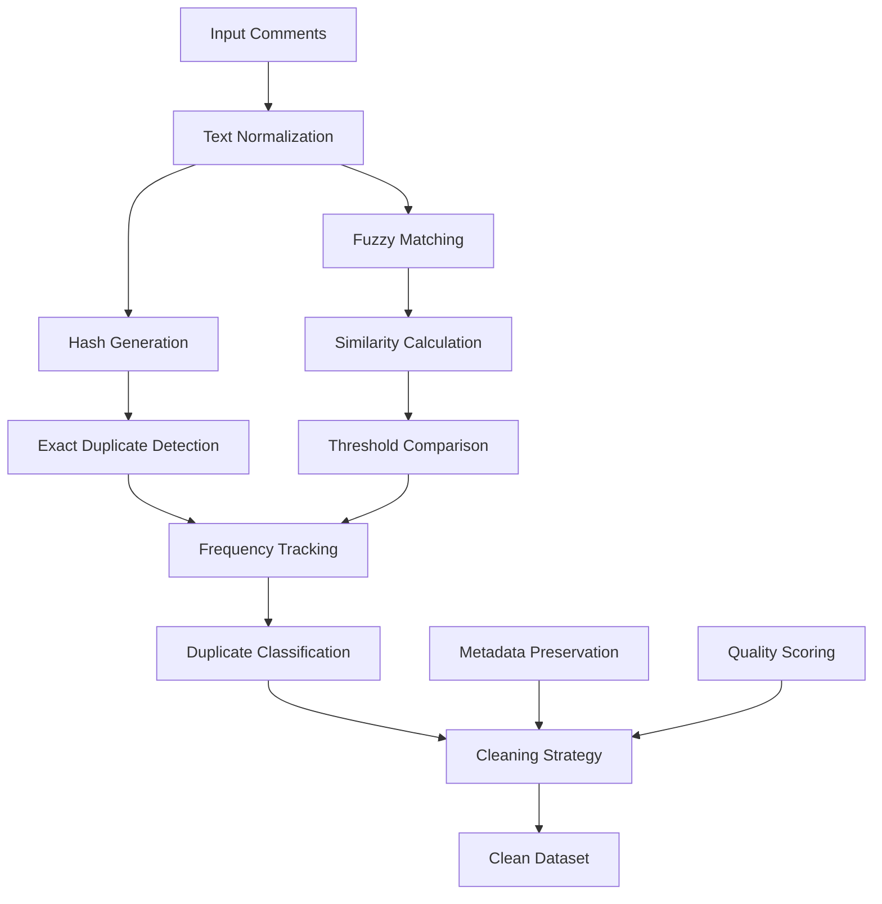

# Duplicate Cleaner Documentation

## Overview

The `DuplicateCleaner` class provides sophisticated duplicate detection and removal capabilities for customer comments in the Personal Paraguay Fiber Comments Analysis system. It implements both exact matching and fuzzy matching algorithms to identify similar content while maintaining data integrity and tracking frequency statistics.

---

## Architecture

### Class Structure

```python
class DuplicateCleaner:
    """Tool for detecting and cleaning duplicate comments with frequency tracking"""
    
    def __init__(self, similarity_threshold: float = 0.95):
        self.similarity_threshold = similarity_threshold
        self.duplicate_stats = {}
        self.cleaned_data = None
```

### Duplicate Detection Pipeline



---

## Core Features

### 1. Text Normalization

```python
def clean_text(self, text: str) -> str:
    """Normalize text for comparison"""
    if pd.isna(text):
        return ""
    
    # Convert to lowercase and remove extra spaces
    text = str(text).lower().strip()
    text = re.sub(r'\s+', ' ', text)
    
    # Remove punctuation for comparison
    text = re.sub(r'[^\w\s]', '', text)
    
    return text
```

**Normalization Process:**
1. **Case Normalization**: Convert to lowercase
2. **Whitespace Cleanup**: Remove extra spaces and normalize
3. **Punctuation Removal**: Strip punctuation for core content comparison
4. **Encoding Standardization**: Ensure consistent character encoding
5. **Special Character Handling**: Process accented characters uniformly

**Example:**
```python
# Input
text = "¡¡Excelente    Servicio!! 😊"

# Output after normalization
normalized = "excelente servicio"
```

### 2. Hash-Based Exact Duplicate Detection

```python
def generate_hash(self, text: str) -> str:
    """Generate hash for exact duplicate detection"""
    cleaned = self.clean_text(text)
    return hashlib.md5(cleaned.encode()).hexdigest()

def find_exact_duplicates(self, df: pd.DataFrame, text_column: str = 'Comentario Final') -> Dict:
    """
    Find exact duplicates using hash-based comparison
    
    Args:
        df: DataFrame with comments
        text_column: Column containing comment text
        
    Returns:
        Dictionary with duplicate information
    """
    
    hash_map = {}
    exact_duplicates = []
    duplicate_groups = defaultdict(list)
    
    for index, row in df.iterrows():
        text = row[text_column]
        text_hash = self.generate_hash(text)
        
        if text_hash in hash_map:
            # Found duplicate
            original_index = hash_map[text_hash]
            exact_duplicates.append({
                'original_index': original_index,
                'duplicate_index': index,
                'text': text,
                'hash': text_hash
            })
            duplicate_groups[text_hash].append(index)
        else:
            hash_map[text_hash] = index
            duplicate_groups[text_hash].append(index)
    
    return {
        'duplicates': exact_duplicates,
        'groups': duplicate_groups,
        'total_duplicates': len(exact_duplicates),
        'unique_groups': len([g for g in duplicate_groups.values() if len(g) > 1])
    }
```

**Hash-Based Features:**
- **MD5 Hashing**: Fast comparison using cryptographic hashes
- **Collision Detection**: Handle hash collisions gracefully
- **Group Tracking**: Maintain groups of identical comments
- **Index Preservation**: Keep original DataFrame indices for reference

### 3. Fuzzy Matching Algorithm

```python
def calculate_similarity(self, text1: str, text2: str) -> float:
    """
    Calculate similarity between two texts using multiple metrics
    
    Args:
        text1, text2: Texts to compare
        
    Returns:
        Similarity score between 0 and 1
    """
    
    # Normalize both texts
    clean1 = self.clean_text(text1)
    clean2 = self.clean_text(text2)
    
    if not clean1 or not clean2:
        return 0.0
    
    # Method 1: Levenshtein distance
    levenshtein_score = self._levenshtein_similarity(clean1, clean2)
    
    # Method 2: Jaccard similarity (word-based)
    jaccard_score = self._jaccard_similarity(clean1, clean2)
    
    # Method 3: Token-based similarity
    token_score = self._token_similarity(clean1, clean2)
    
    # Method 4: N-gram similarity
    ngram_score = self._ngram_similarity(clean1, clean2, n=3)
    
    # Weighted combination
    final_score = (
        levenshtein_score * 0.3 +
        jaccard_score * 0.3 +
        token_score * 0.2 +
        ngram_score * 0.2
    )
    
    return final_score

def _levenshtein_similarity(self, s1: str, s2: str) -> float:
    """Calculate Levenshtein distance-based similarity"""
    import Levenshtein
    
    distance = Levenshtein.distance(s1, s2)
    max_len = max(len(s1), len(s2))
    
    if max_len == 0:
        return 1.0
    
    return 1 - (distance / max_len)

def _jaccard_similarity(self, s1: str, s2: str) -> float:
    """Calculate Jaccard similarity based on word sets"""
    words1 = set(s1.split())
    words2 = set(s2.split())
    
    if not words1 and not words2:
        return 1.0
    
    intersection = words1.intersection(words2)
    union = words1.union(words2)
    
    return len(intersection) / len(union) if union else 0.0

def _token_similarity(self, s1: str, s2: str) -> float:
    """Calculate token-based similarity with position weighting"""
    tokens1 = s1.split()
    tokens2 = s2.split()
    
    if not tokens1 or not tokens2:
        return 0.0
    
    # Create position-weighted token maps
    weights1 = {token: 1.0 / (i + 1) for i, token in enumerate(tokens1)}
    weights2 = {token: 1.0 / (i + 1) for i, token in enumerate(tokens2)}
    
    # Calculate weighted intersection
    common_tokens = set(tokens1).intersection(set(tokens2))
    similarity = sum(min(weights1[token], weights2[token]) for token in common_tokens)
    
    # Normalize by maximum possible similarity
    max_similarity = min(sum(weights1.values()), sum(weights2.values()))
    
    return similarity / max_similarity if max_similarity > 0 else 0.0

def _ngram_similarity(self, s1: str, s2: str, n: int = 3) -> float:
    """Calculate n-gram based similarity"""
    
    def get_ngrams(text: str, n: int) -> set:
        if len(text) < n:
            return {text}
        return {text[i:i+n] for i in range(len(text) - n + 1)}
    
    ngrams1 = get_ngrams(s1, n)
    ngrams2 = get_ngrams(s2, n)
    
    if not ngrams1 and not ngrams2:
        return 1.0
    
    intersection = ngrams1.intersection(ngrams2)
    union = ngrams1.union(ngrams2)
    
    return len(intersection) / len(union) if union else 0.0
```

**Fuzzy Matching Features:**
- **Multiple Algorithms**: Combines 4 different similarity metrics
- **Weighted Scoring**: Optimized weights for comment analysis
- **Position Awareness**: Considers word position in similarity calculation
- **N-gram Analysis**: Character-level similarity detection
- **Threshold Configuration**: Adjustable similarity thresholds

### 4. Advanced Duplicate Detection

```python
def find_fuzzy_duplicates(self, df: pd.DataFrame, 
                         text_column: str = 'Comentario Final',
                         batch_size: int = 1000) -> Dict:
    """
    Find fuzzy duplicates using similarity algorithms
    
    Args:
        df: DataFrame with comments
        text_column: Column containing comment text
        batch_size: Process in batches for memory efficiency
        
    Returns:
        Dictionary with fuzzy duplicate information
    """
    
    fuzzy_duplicates = []
    processed_pairs = set()
    
    # Process in batches for memory efficiency
    total_rows = len(df)
    
    for batch_start in range(0, total_rows, batch_size):
        batch_end = min(batch_start + batch_size, total_rows)
        batch_df = df.iloc[batch_start:batch_end]
        
        logger.info(f"Processing batch {batch_start}-{batch_end} of {total_rows}")
        
        # Compare within batch
        for i, row1 in batch_df.iterrows():
            text1 = row1[text_column]
            
            # Compare with remaining items in current batch
            for j, row2 in batch_df.iloc[batch_df.index.get_loc(i)+1:].iterrows():
                text2 = row2[text_column]
                
                # Skip if already processed
                pair_key = tuple(sorted([i, j]))
                if pair_key in processed_pairs:
                    continue
                
                processed_pairs.add(pair_key)
                
                # Calculate similarity
                similarity = self.calculate_similarity(text1, text2)
                
                if similarity >= self.similarity_threshold:
                    fuzzy_duplicates.append({
                        'index1': i,
                        'index2': j,
                        'text1': text1,
                        'text2': text2,
                        'similarity': similarity
                    })
        
        # Compare across batches (sliding window)
        if batch_start > 0:
            prev_batch_df = df.iloc[max(0, batch_start-batch_size):batch_start]
            
            for i, row1 in prev_batch_df.iterrows():
                text1 = row1[text_column]
                
                for j, row2 in batch_df.iterrows():
                    text2 = row2[text_column]
                    
                    pair_key = tuple(sorted([i, j]))
                    if pair_key in processed_pairs:
                        continue
                    
                    processed_pairs.add(pair_key)
                    similarity = self.calculate_similarity(text1, text2)
                    
                    if similarity >= self.similarity_threshold:
                        fuzzy_duplicates.append({
                            'index1': i,
                            'index2': j,
                            'text1': text1,
                            'text2': text2,
                            'similarity': similarity
                        })
    
    return {
        'fuzzy_duplicates': fuzzy_duplicates,
        'total_fuzzy': len(fuzzy_duplicates),
        'average_similarity': np.mean([d['similarity'] for d in fuzzy_duplicates]) if fuzzy_duplicates else 0,
        'similarity_distribution': self._calculate_similarity_distribution(fuzzy_duplicates)
    }
```

### 5. Intelligent Duplicate Removal

```python
def remove_duplicates(self, df: pd.DataFrame, 
                     strategy: str = 'keep_best',
                     quality_column: str = None) -> pd.DataFrame:
    """
    Remove duplicates using intelligent strategies
    
    Args:
        df: DataFrame with comments
        strategy: Removal strategy ('keep_first', 'keep_last', 'keep_best', 'merge')
        quality_column: Column to use for quality assessment
        
    Returns:
        Cleaned DataFrame
    """
    
    # Find all duplicates
    exact_dupes = self.find_exact_duplicates(df)
    fuzzy_dupes = self.find_fuzzy_duplicates(df)
    
    # Create removal plan
    removal_plan = self._create_removal_plan(df, exact_dupes, fuzzy_dupes, strategy, quality_column)
    
    # Apply removal strategy
    if strategy == 'keep_best':
        cleaned_df = self._keep_best_duplicates(df, removal_plan, quality_column)
    elif strategy == 'keep_first':
        cleaned_df = self._keep_first_duplicates(df, removal_plan)
    elif strategy == 'keep_last':
        cleaned_df = self._keep_last_duplicates(df, removal_plan)
    elif strategy == 'merge':
        cleaned_df = self._merge_duplicates(df, removal_plan)
    else:
        raise ValueError(f"Unknown strategy: {strategy}")
    
    # Update statistics
    self.duplicate_stats = {
        'original_count': len(df),
        'cleaned_count': len(cleaned_df),
        'duplicates_removed': len(df) - len(cleaned_df),
        'reduction_percentage': ((len(df) - len(cleaned_df)) / len(df)) * 100,
        'exact_duplicates': exact_dupes['total_duplicates'],
        'fuzzy_duplicates': fuzzy_dupes['total_fuzzy'],
        'strategy_used': strategy
    }
    
    self.cleaned_data = cleaned_df
    return cleaned_df

def _calculate_quality_score(self, row: pd.Series, quality_column: str = None) -> float:
    """Calculate quality score for a comment"""
    
    if quality_column and quality_column in row:
        # Use provided quality column
        return float(row[quality_column])
    
    # Calculate quality based on multiple factors
    text = str(row.get('Comentario Final', ''))
    
    quality_factors = {
        'length': min(len(text) / 100, 1.0),  # Longer is better (up to 100 chars)
        'completeness': 1.0 if text.strip() else 0.0,
        'metadata_richness': 0.0,
        'date_presence': 0.0
    }
    
    # Check for metadata richness
    metadata_fields = ['Fecha', 'Cliente_ID', 'Categoria', 'Ubicacion']
    present_metadata = sum(1 for field in metadata_fields if field in row and pd.notna(row[field]))
    quality_factors['metadata_richness'] = present_metadata / len(metadata_fields)
    
    # Check for date presence
    if 'Fecha' in row and pd.notna(row['Fecha']):
        quality_factors['date_presence'] = 1.0
    
    # Weighted quality score
    weights = {
        'length': 0.3,
        'completeness': 0.4,
        'metadata_richness': 0.2,
        'date_presence': 0.1
    }
    
    return sum(quality_factors[factor] * weights[factor] for factor in quality_factors)

def _keep_best_duplicates(self, df: pd.DataFrame, removal_plan: Dict, quality_column: str) -> pd.DataFrame:
    """Keep the best quality duplicate from each group"""
    
    indices_to_remove = set()
    
    for group_id, duplicate_group in removal_plan.items():
        if len(duplicate_group) <= 1:
            continue
        
        # Calculate quality scores for all duplicates in group
        quality_scores = []
        for idx in duplicate_group:
            row = df.loc[idx]
            quality = self._calculate_quality_score(row, quality_column)
            quality_scores.append((idx, quality))
        
        # Sort by quality (highest first)
        quality_scores.sort(key=lambda x: x[1], reverse=True)
        
        # Keep the best one, mark others for removal
        best_idx = quality_scores[0][0]
        for idx, _ in quality_scores[1:]:
            indices_to_remove.add(idx)
    
    # Remove marked indices
    cleaned_df = df.drop(indices_to_remove).copy()
    return cleaned_df

def _merge_duplicates(self, df: pd.DataFrame, removal_plan: Dict) -> pd.DataFrame:
    """Merge duplicate comments by combining information"""
    
    merged_data = []
    processed_indices = set()
    
    for group_id, duplicate_group in removal_plan.items():
        if len(duplicate_group) <= 1:
            # No duplicates, keep as is
            for idx in duplicate_group:
                if idx not in processed_indices:
                    merged_data.append(df.loc[idx].to_dict())
                    processed_indices.add(idx)
        else:
            # Merge duplicates
            merged_row = self._create_merged_row(df, duplicate_group)
            merged_data.append(merged_row)
            processed_indices.update(duplicate_group)
    
    # Add remaining non-duplicate rows
    for idx, row in df.iterrows():
        if idx not in processed_indices:
            merged_data.append(row.to_dict())
    
    return pd.DataFrame(merged_data)

def _create_merged_row(self, df: pd.DataFrame, duplicate_indices: List[int]) -> Dict:
    """Create a merged row from duplicate entries"""
    
    rows = [df.loc[idx] for idx in duplicate_indices]
    merged_row = {}
    
    # Merge text (use the longest/most complete version)
    text_versions = [str(row.get('Comentario Final', '')) for row in rows]
    merged_row['Comentario Final'] = max(text_versions, key=len)
    
    # Merge dates (use earliest)
    dates = [row.get('Fecha') for row in rows if pd.notna(row.get('Fecha'))]
    if dates:
        merged_row['Fecha'] = min(dates)
    
    # Merge numeric fields (use average or most common)
    numeric_fields = ['Nota', 'Calificacion', 'Puntuacion']
    for field in numeric_fields:
        values = [row.get(field) for row in rows if pd.notna(row.get(field))]
        if values:
            merged_row[field] = np.mean(values)
    
    # Merge categorical fields (use most common)
    categorical_fields = ['Categoria', 'Tipo', 'Ubicacion', 'Cliente_ID']
    for field in categorical_fields:
        values = [row.get(field) for row in rows if pd.notna(row.get(field))]
        if values:
            merged_row[field] = Counter(values).most_common(1)[0][0]
    
    # Add merge metadata
    merged_row['_merged_from'] = duplicate_indices
    merged_row['_merge_count'] = len(duplicate_indices)
    merged_row['_merge_strategy'] = 'intelligent_merge'
    
    return merged_row
```

---

## Frequency Tracking and Analytics

### Duplicate Frequency Analysis

```python
def analyze_duplicate_frequencies(self, df: pd.DataFrame) -> Dict:
    """
    Analyze frequency patterns in duplicate comments
    
    Args:
        df: DataFrame with comments
        
    Returns:
        Detailed frequency analysis
    """
    
    exact_dupes = self.find_exact_duplicates(df)
    frequency_analysis = {}
    
    # Analyze exact duplicate frequencies
    duplicate_groups = exact_dupes['groups']
    frequency_distribution = {}
    
    for text_hash, indices in duplicate_groups.items():
        frequency = len(indices)
        if frequency > 1:  # Only count actual duplicates
            if frequency not in frequency_distribution:
                frequency_distribution[frequency] = 0
            frequency_distribution[frequency] += 1
    
    # Most frequently duplicated comments
    most_frequent = []
    for text_hash, indices in duplicate_groups.items():
        if len(indices) > 2:  # 3+ occurrences
            sample_text = df.loc[indices[0]]['Comentario Final']
            most_frequent.append({
                'text': sample_text,
                'frequency': len(indices),
                'indices': indices,
                'percentage': (len(indices) / len(df)) * 100
            })
    
    # Sort by frequency
    most_frequent.sort(key=lambda x: x['frequency'], reverse=True)
    
    # Time-based frequency analysis (if dates available)
    temporal_analysis = None
    if 'Fecha' in df.columns:
        temporal_analysis = self._analyze_temporal_duplicates(df, duplicate_groups)
    
    frequency_analysis = {
        'frequency_distribution': frequency_distribution,
        'most_frequent_comments': most_frequent[:10],  # Top 10
        'total_duplicate_instances': sum(len(indices) for indices in duplicate_groups.values() if len(indices) > 1),
        'unique_duplicate_patterns': len([g for g in duplicate_groups.values() if len(g) > 1]),
        'temporal_analysis': temporal_analysis
    }
    
    return frequency_analysis

def _analyze_temporal_duplicates(self, df: pd.DataFrame, duplicate_groups: Dict) -> Dict:
    """Analyze how duplicates are distributed over time"""
    
    temporal_patterns = {}
    
    for text_hash, indices in duplicate_groups.items():
        if len(indices) <= 1:
            continue
        
        # Get dates for this duplicate group
        dates = []
        for idx in indices:
            date = df.loc[idx].get('Fecha')
            if pd.notna(date):
                dates.append(pd.to_datetime(date))
        
        if len(dates) > 1:
            dates.sort()
            
            # Calculate time spans
            time_span = (dates[-1] - dates[0]).days
            
            # Calculate frequency patterns
            if time_span == 0:
                pattern = 'same_day'
            elif time_span <= 7:
                pattern = 'same_week'
            elif time_span <= 30:
                pattern = 'same_month'
            else:
                pattern = 'long_term'
            
            if pattern not in temporal_patterns:
                temporal_patterns[pattern] = []
            
            temporal_patterns[pattern].append({
                'text_hash': text_hash,
                'frequency': len(indices),
                'time_span_days': time_span,
                'first_occurrence': dates[0],
                'last_occurrence': dates[-1]
            })
    
    return temporal_patterns
```

---

## Performance Optimization

### Memory-Efficient Processing

```python
def process_large_dataset(self, file_path: str, 
                         chunk_size: int = 10000,
                         output_path: str = None) -> Dict:
    """
    Process large datasets efficiently using chunking
    
    Args:
        file_path: Path to large dataset file
        chunk_size: Number of records per chunk
        output_path: Path to save cleaned dataset
        
    Returns:
        Processing summary
    """
    
    global_hash_map = {}
    cleaned_chunks = []
    processing_stats = {
        'total_processed': 0,
        'total_duplicates': 0,
        'chunks_processed': 0,
        'processing_time': 0
    }
    
    start_time = time.time()
    
    # Process file in chunks
    for chunk_id, chunk_df in enumerate(pd.read_csv(file_path, chunksize=chunk_size)):
        logger.info(f"Processing chunk {chunk_id + 1}, size: {len(chunk_df)}")
        
        # Find duplicates within chunk
        chunk_dupes = self.find_exact_duplicates(chunk_df)
        
        # Check for duplicates against global hash map
        cross_chunk_duplicates = []
        for idx, row in chunk_df.iterrows():
            text_hash = self.generate_hash(row['Comentario Final'])
            
            if text_hash in global_hash_map:
                cross_chunk_duplicates.append(idx)
            else:
                global_hash_map[text_hash] = {
                    'chunk_id': chunk_id,
                    'index': idx,
                    'text': row['Comentario Final']
                }
        
        # Remove duplicates from chunk
        all_duplicate_indices = set()
        
        # Add within-chunk duplicates
        for dup in chunk_dupes['duplicates']:
            all_duplicate_indices.add(dup['duplicate_index'])
        
        # Add cross-chunk duplicates
        all_duplicate_indices.update(cross_chunk_duplicates)
        
        # Clean chunk
        cleaned_chunk = chunk_df.drop(all_duplicate_indices)
        cleaned_chunks.append(cleaned_chunk)
        
        # Update statistics
        processing_stats['total_processed'] += len(chunk_df)
        processing_stats['total_duplicates'] += len(all_duplicate_indices)
        processing_stats['chunks_processed'] += 1
        
        # Memory cleanup
        del chunk_df
        gc.collect()
    
    # Combine cleaned chunks
    final_cleaned_df = pd.concat(cleaned_chunks, ignore_index=True)
    
    # Save if output path provided
    if output_path:
        final_cleaned_df.to_csv(output_path, index=False)
        logger.info(f"Cleaned dataset saved to: {output_path}")
    
    processing_stats['processing_time'] = time.time() - start_time
    processing_stats['final_size'] = len(final_cleaned_df)
    processing_stats['reduction_percentage'] = (processing_stats['total_duplicates'] / processing_stats['total_processed']) * 100
    
    return {
        'cleaned_data': final_cleaned_df,
        'statistics': processing_stats,
        'global_duplicates': len(global_hash_map)
    }
```

### Parallel Processing Support

```python
def parallel_duplicate_detection(self, df: pd.DataFrame, 
                               n_workers: int = 4) -> Dict:
    """
    Detect duplicates using parallel processing
    
    Args:
        df: DataFrame to process
        n_workers: Number of parallel workers
        
    Returns:
        Combined duplicate detection results
    """
    
    from concurrent.futures import ProcessPoolExecutor
    import numpy as np
    
    # Split dataframe into chunks for parallel processing
    chunk_size = len(df) // n_workers
    chunks = []
    
    for i in range(n_workers):
        start_idx = i * chunk_size
        if i == n_workers - 1:
            end_idx = len(df)  # Last chunk gets remainder
        else:
            end_idx = (i + 1) * chunk_size
        
        chunk = df.iloc[start_idx:end_idx].copy()
        chunk['_original_index'] = chunk.index
        chunks.append(chunk)
    
    # Process chunks in parallel
    with ProcessPoolExecutor(max_workers=n_workers) as executor:
        # Submit chunk processing jobs
        futures = []
        for i, chunk in enumerate(chunks):
            future = executor.submit(self._process_chunk_parallel, chunk, i)
            futures.append(future)
        
        # Collect results
        chunk_results = []
        for future in futures:
            try:
                result = future.result()
                chunk_results.append(result)
            except Exception as e:
                logger.error(f"Chunk processing failed: {e}")
    
    # Merge results from all chunks
    merged_results = self._merge_parallel_results(chunk_results, df)
    
    return merged_results

def _process_chunk_parallel(self, chunk_df: pd.DataFrame, chunk_id: int) -> Dict:
    """Process a single chunk in parallel worker"""
    
    # Find exact duplicates within chunk
    exact_dupes = self.find_exact_duplicates(chunk_df)
    
    # Create hash map for cross-chunk comparison
    hash_map = {}
    for idx, row in chunk_df.iterrows():
        text_hash = self.generate_hash(row['Comentario Final'])
        hash_map[text_hash] = {
            'original_index': row['_original_index'],
            'chunk_id': chunk_id,
            'text': row['Comentario Final']
        }
    
    return {
        'chunk_id': chunk_id,
        'exact_duplicates': exact_dupes,
        'hash_map': hash_map,
        'chunk_size': len(chunk_df)
    }

def _merge_parallel_results(self, chunk_results: List[Dict], original_df: pd.DataFrame) -> Dict:
    """Merge results from parallel processing"""
    
    # Combine hash maps to find cross-chunk duplicates
    global_hash_map = {}
    cross_chunk_duplicates = []
    
    for result in chunk_results:
        chunk_hash_map = result['hash_map']
        
        for text_hash, info in chunk_hash_map.items():
            if text_hash in global_hash_map:
                # Found cross-chunk duplicate
                original_info = global_hash_map[text_hash]
                cross_chunk_duplicates.append({
                    'text_hash': text_hash,
                    'original_chunk': original_info['chunk_id'],
                    'original_index': original_info['original_index'],
                    'duplicate_chunk': info['chunk_id'],
                    'duplicate_index': info['original_index'],
                    'text': info['text']
                })
            else:
                global_hash_map[text_hash] = info
    
    # Combine within-chunk duplicates
    all_exact_duplicates = []
    for result in chunk_results:
        chunk_dupes = result['exact_duplicates']['duplicates']
        all_exact_duplicates.extend(chunk_dupes)
    
    return {
        'within_chunk_duplicates': all_exact_duplicates,
        'cross_chunk_duplicates': cross_chunk_duplicates,
        'total_exact_duplicates': len(all_exact_duplicates) + len(cross_chunk_duplicates),
        'processing_summary': {
            'chunks_processed': len(chunk_results),
            'total_unique_hashes': len(global_hash_map),
            'cross_chunk_duplicate_rate': len(cross_chunk_duplicates) / len(global_hash_map) * 100 if global_hash_map else 0
        }
    }
```

---

## Integration and Usage Examples

### Streamlit Integration

```python
def render_duplicate_cleaner_ui(self):
    """Render duplicate cleaner interface in Streamlit"""
    
    st.title("🔍 Duplicate Detection & Cleaning")
    
    if 'uploaded_df' not in st.session_state:
        st.warning("Please upload a file first!")
        return
    
    df = st.session_state.uploaded_df
    
    # Configuration section
    st.subheader("Configuration")
    col1, col2, col3 = st.columns(3)
    
    with col1:
        similarity_threshold = st.slider(
            "Similarity Threshold", 
            0.5, 1.0, 0.95, 0.05,
            help="Higher values = more strict matching"
        )
    
    with col2:
        removal_strategy = st.selectbox(
            "Removal Strategy",
            ['keep_best', 'keep_first', 'keep_last', 'merge'],
            help="Strategy for handling duplicates"
        )
    
    with col3:
        enable_fuzzy = st.checkbox(
            "Enable Fuzzy Matching", 
            value=True,
            help="Detect similar (not identical) comments"
        )
    
    # Update configuration
    self.similarity_threshold = similarity_threshold
    
    # Analysis section
    st.subheader("Duplicate Analysis")
    
    if st.button("🔍 Analyze Duplicates", type="primary"):
        with st.spinner("Analyzing duplicates..."):
            
            # Find exact duplicates
            exact_results = self.find_exact_duplicates(df)
            
            # Find fuzzy duplicates if enabled
            fuzzy_results = None
            if enable_fuzzy:
                fuzzy_results = self.find_fuzzy_duplicates(df)
            
            # Display results
            self._display_duplicate_analysis(exact_results, fuzzy_results)
            
            # Store results in session state
            st.session_state.duplicate_results = {
                'exact': exact_results,
                'fuzzy': fuzzy_results
            }
    
    # Cleaning section
    if 'duplicate_results' in st.session_state:
        st.subheader("Data Cleaning")
        
        if st.button("🧹 Clean Duplicates", type="secondary"):
            with st.spinner("Cleaning duplicates..."):
                cleaned_df = self.remove_duplicates(df, removal_strategy)
                
                st.success(f"✅ Cleaning complete!")
                st.info(f"Original: {len(df):,} comments")
                st.info(f"Cleaned: {len(cleaned_df):,} comments")
                st.info(f"Removed: {len(df) - len(cleaned_df):,} duplicates")
                
                # Update session state with cleaned data
                st.session_state.cleaned_df = cleaned_df
                
                # Display cleaning summary
                self._display_cleaning_summary()

def _display_duplicate_analysis(self, exact_results: Dict, fuzzy_results: Dict = None):
    """Display duplicate analysis results"""
    
    # Metrics
    col1, col2, col3, col4 = st.columns(4)
    
    with col1:
        st.metric("Exact Duplicates", exact_results['total_duplicates'])
    
    with col2:
        if fuzzy_results:
            st.metric("Fuzzy Duplicates", fuzzy_results['total_fuzzy'])
        else:
            st.metric("Fuzzy Duplicates", "Disabled")
    
    with col3:
        total_dupes = exact_results['total_duplicates']
        if fuzzy_results:
            total_dupes += fuzzy_results['total_fuzzy']
        st.metric("Total Duplicates", total_dupes)
    
    with col4:
        duplicate_groups = len([g for g in exact_results['groups'].values() if len(g) > 1])
        st.metric("Duplicate Groups", duplicate_groups)
    
    # Example duplicates
    if exact_results['duplicates']:
        st.subheader("Example Duplicates")
        
        # Show first few duplicate examples
        for i, dup in enumerate(exact_results['duplicates'][:3]):
            with st.expander(f"Duplicate Group {i+1}"):
                st.write("**Text:**", dup['text'])
                st.write("**Hash:**", dup['hash'])
                st.write("**Indices:**", [dup['original_index'], dup['duplicate_index']])
    
    # Fuzzy duplicates
    if fuzzy_results and fuzzy_results['fuzzy_duplicates']:
        st.subheader("Fuzzy Duplicate Examples")
        
        for i, dup in enumerate(fuzzy_results['fuzzy_duplicates'][:3]):
            with st.expander(f"Similar Pair {i+1} (Similarity: {dup['similarity']:.3f})"):
                col1, col2 = st.columns(2)
                with col1:
                    st.write("**Text 1:**", dup['text1'])
                with col2:
                    st.write("**Text 2:**", dup['text2'])
```

### API Integration

```python
def create_duplicate_api_endpoint():
    """Create API endpoint for duplicate detection"""
    
    from flask import Flask, request, jsonify
    
    app = Flask(__name__)
    
    @app.route('/api/duplicates/detect', methods=['POST'])
    def detect_duplicates():
        """API endpoint for duplicate detection"""
        
        try:
            data = request.get_json()
            
            # Validate input
            if 'comments' not in data:
                return jsonify({'error': 'comments field required'}), 400
            
            # Convert to DataFrame
            df = pd.DataFrame(data['comments'])
            
            # Initialize cleaner with configuration
            config = data.get('config', {})
            similarity_threshold = config.get('similarity_threshold', 0.95)
            enable_fuzzy = config.get('enable_fuzzy', True)
            
            cleaner = DuplicateCleaner(similarity_threshold=similarity_threshold)
            
            # Detect duplicates
            exact_results = cleaner.find_exact_duplicates(df)
            
            fuzzy_results = None
            if enable_fuzzy:
                fuzzy_results = cleaner.find_fuzzy_duplicates(df)
            
            # Format response
            response = {
                'status': 'success',
                'results': {
                    'exact_duplicates': exact_results,
                    'fuzzy_duplicates': fuzzy_results,
                    'summary': {
                        'total_comments': len(df),
                        'exact_duplicate_count': exact_results['total_duplicates'],
                        'fuzzy_duplicate_count': fuzzy_results['total_fuzzy'] if fuzzy_results else 0
                    }
                }
            }
            
            return jsonify(response)
            
        except Exception as e:
            return jsonify({
                'status': 'error',
                'error': str(e)
            }), 500
    
    @app.route('/api/duplicates/clean', methods=['POST'])
    def clean_duplicates():
        """API endpoint for duplicate cleaning"""
        
        try:
            data = request.get_json()
            
            # Convert to DataFrame
            df = pd.DataFrame(data['comments'])
            
            # Configuration
            config = data.get('config', {})
            strategy = config.get('strategy', 'keep_best')
            similarity_threshold = config.get('similarity_threshold', 0.95)
            
            # Clean duplicates
            cleaner = DuplicateCleaner(similarity_threshold=similarity_threshold)
            cleaned_df = cleaner.remove_duplicates(df, strategy=strategy)
            
            # Return cleaned data
            response = {
                'status': 'success',
                'cleaned_data': cleaned_df.to_dict('records'),
                'statistics': cleaner.duplicate_stats
            }
            
            return jsonify(response)
            
        except Exception as e:
            return jsonify({
                'status': 'error',
                'error': str(e)
            }), 500
    
    return app
```

---

## Testing and Validation

### Unit Tests

```python
import unittest
import pandas as pd

class TestDuplicateCleaner(unittest.TestCase):
    
    def setUp(self):
        self.cleaner = DuplicateCleaner(similarity_threshold=0.95)
        self.sample_data = pd.DataFrame({
            'Comentario Final': [
                'Excelente servicio',
                'EXCELENTE SERVICIO!!!',  # Similar
                'Muy malo el servicio',
                'Excelente servicio',     # Exact duplicate
                'El servicio es excelente', # Similar
                'Regular atención'
            ],
            'Fecha': ['2024-01-01', '2024-01-02', '2024-01-03', 
                     '2024-01-04', '2024-01-05', '2024-01-06']
        })
    
    def test_text_normalization(self):
        """Test text normalization function"""
        
        test_cases = [
            ('¡¡Excelente Servicio!!', 'excelente servicio'),
            ('  MUCHO   ESPACIO  ', 'mucho espacio'),
            ('Número 123 y símbolos @#$', 'número 123 y símbolos'),
        ]
        
        for input_text, expected in test_cases:
            result = self.cleaner.clean_text(input_text)
            self.assertEqual(result, expected)
    
    def test_exact_duplicate_detection(self):
        """Test exact duplicate detection"""
        
        results = self.cleaner.find_exact_duplicates(self.sample_data)
        
        # Should find 1 exact duplicate (indices 0 and 3)
        self.assertEqual(results['total_duplicates'], 1)
        self.assertEqual(len(results['duplicates']), 1)
        
        # Check duplicate details
        duplicate = results['duplicates'][0]
        self.assertEqual(duplicate['original_index'], 0)
        self.assertEqual(duplicate['duplicate_index'], 3)
    
    def test_fuzzy_duplicate_detection(self):
        """Test fuzzy duplicate detection"""
        
        results = self.cleaner.find_fuzzy_duplicates(self.sample_data)
        
        # Should find similar comments
        self.assertGreater(results['total_fuzzy'], 0)
        
        # Check similarity scores
        for fuzzy_dup in results['fuzzy_duplicates']:
            self.assertGreaterEqual(fuzzy_dup['similarity'], self.cleaner.similarity_threshold)
    
    def test_similarity_calculation(self):
        """Test similarity calculation methods"""
        
        test_pairs = [
            ('excelente servicio', 'excelente servicio', 1.0),  # Identical
            ('excelente servicio', 'EXCELENTE SERVICIO', 1.0),  # Case difference
            ('excelente servicio', 'buen servicio', 0.5),       # Partial match
            ('excelente servicio', 'terrible atencion', 0.0)    # No match
        ]
        
        for text1, text2, expected_min in test_pairs:
            similarity = self.cleaner.calculate_similarity(text1, text2)
            if expected_min == 1.0:
                self.assertAlmostEqual(similarity, expected_min, places=2)
            else:
                self.assertGreaterEqual(similarity, expected_min - 0.1)
    
    def test_duplicate_removal_strategies(self):
        """Test different duplicate removal strategies"""
        
        strategies = ['keep_first', 'keep_last', 'keep_best']
        
        for strategy in strategies:
            cleaned_df = self.cleaner.remove_duplicates(self.sample_data, strategy=strategy)
            
            # Should remove at least 1 duplicate
            self.assertLess(len(cleaned_df), len(self.sample_data))
            
            # Check statistics
            stats = self.cleaner.duplicate_stats
            self.assertGreater(stats['duplicates_removed'], 0)
            self.assertEqual(stats['strategy_used'], strategy)
    
    def test_frequency_analysis(self):
        """Test duplicate frequency analysis"""
        
        # Create data with known duplicates
        duplicate_data = pd.DataFrame({
            'Comentario Final': [
                'Comment A', 'Comment A', 'Comment A',  # 3 times
                'Comment B', 'Comment B',               # 2 times
                'Comment C'                             # 1 time
            ]
        })
        
        frequency_results = self.cleaner.analyze_duplicate_frequencies(duplicate_data)
        
        # Check frequency distribution
        freq_dist = frequency_results['frequency_distribution']
        self.assertEqual(freq_dist[3], 1)  # One group with 3 duplicates
        self.assertEqual(freq_dist[2], 1)  # One group with 2 duplicates
        
        # Check most frequent comments
        most_frequent = frequency_results['most_frequent_comments']
        self.assertEqual(most_frequent[0]['frequency'], 3)
        self.assertEqual(most_frequent[0]['text'], 'Comment A')
```

---

## Best Practices

### 1. Configuration Optimization
- Set appropriate similarity thresholds based on data quality
- Choose removal strategies based on business requirements
- Use parallel processing for large datasets
- Monitor memory usage during processing

### 2. Data Quality Considerations
- Validate input data format before processing
- Handle missing or null values appropriately
- Consider domain-specific text patterns
- Preserve important metadata during cleaning

### 3. Performance Guidelines
- Use batch processing for datasets > 10,000 records
- Enable fuzzy matching only when necessary
- Implement progress tracking for long operations
- Cache results for repeated analyses

### 4. Integration Recommendations
- Provide clear feedback to users about duplicate counts
- Allow users to preview duplicates before removal
- Implement undo functionality for cleaning operations
- Export duplicate reports for audit purposes

This comprehensive documentation covers all aspects of the DuplicateCleaner component, providing developers and users with the information needed to effectively detect and manage duplicate comments in the analysis system.