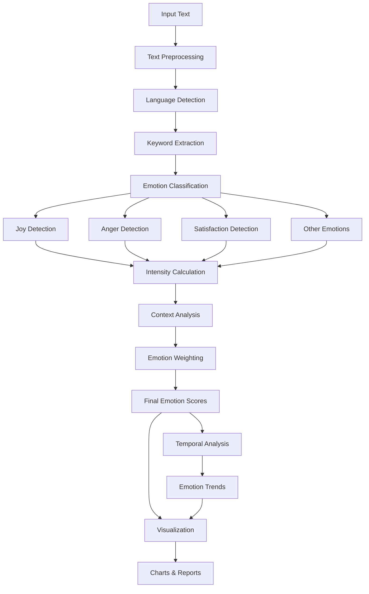

# Emotion Analyzer Documentation

## Overview

The `EmotionAnalyzer` class provides sophisticated emotion detection and analysis capabilities for customer comments in the Personal Paraguay Fiber Comments Analysis system. It implements advanced emotion categorization, intensity scoring, and temporal analysis to extract meaningful emotional insights from Spanish, English, and Guaraní text.

---

## Architecture

### Class Structure

```python
class EmotionAnalyzer:
    """Advanced emotion analysis tool with percentage calculations and trends"""
    
    def __init__(self):
        self.emotion_categories = {
            'joy': {...},
            'satisfaction': {...},
            'frustration': {...},
            'anger': {...},
            'disappointment': {...},
            'anxiety': {...},
            'gratitude': {...},
            'neutral': {...}
        }
        self.intensity_modifiers = {...}
        self.analysis_results = {}
```

### Emotion Analysis Pipeline



---

## Core Features

### 1. Comprehensive Emotion Categories

```python
emotion_categories = {
    'joy': {
        'keywords': [
            'feliz', 'contento', 'alegre', 'excelente', 'perfecto', 
            'genial', 'maravilloso', 'increíble', 'fantástico', 'super',
            'buenísimo', 'me encanta', 'amor', 'adoro', 'mejor'
        ],
        'weight': 1.0,
        'color': '#4CAF50'
    },
    'satisfaction': {
        'keywords': [
            'satisfecho', 'conforme', 'bien', 'bueno', 'correcto',
            'adecuado', 'cumple', 'funciona', 'sirve', 'útil',
            'recomiendo', 'positivo', 'mejoro', 'estable'
        ],
        'weight': 0.8,
        'color': '#8BC34A'
    },
    'frustration': {
        'keywords': [
            'frustrado', 'molesto', 'cansado', 'harto', 'fastidio',
            'no funciona', 'no sirve', 'no anda', 'mal', 'pésimo',
            'terrible', 'horrible', 'desastre', 'siempre falla'
        ],
        'weight': -0.9,
        'color': '#F44336'
    },
    'anger': {
        'keywords': [
            'enojado', 'furioso', 'indignado', 'bronca', 'rabia',
            'ira', 'odio', 'detesto', 'inaceptable', 'vergüenza',
            'indignante', 'inadmisible', 'intolerable'
        ],
        'weight': -1.0,
        'color': '#D32F2F'
    },
    'disappointment': {
        'keywords': [
            'decepción', 'decepcionado', 'esperaba más', 'triste',
            'desilusión', 'lástima', 'podría ser mejor', 'regular',
            'más o menos', 'meh', 'no es lo que', 'mediocre'
        ],
        'weight': -0.6,
        'color': '#FF9800'
    },
    'anxiety': {
        'keywords': [
            'preocupado', 'ansioso', 'nervioso', 'inquieto', 'tenso',
            'estresado', 'agobiado', 'desesperado', 'urgente', 'miedo',
            'temor', 'angustia', 'incertidumbre'
        ],
        'weight': -0.7,
        'color': '#9C27B0'
    },
    'gratitude': {
        'keywords': [
            'gracias', 'agradezco', 'agradecido', 'agradecer', 'amable',
            'atento', 'ayuda', 'solucionó', 'resolvió', 'apoyo',
            'colaboración', 'servicial', 'cordial'
        ],
        'weight': 0.9,
        'color': '#2196F3'
    },
    'neutral': {
        'keywords': [
            'normal', 'regular', 'ok', 'está bien', 'aceptable',
            'promedio', 'estándar', 'común', 'ni bien ni mal'
        ],
        'weight': 0.0,
        'color': '#9E9E9E'
    }
}
```

**Emotion Category Features:**
- **8 Primary Emotions**: Comprehensive coverage of customer feedback emotions
- **Weighted Scoring**: Each emotion has different impact weights
- **Multi-language Support**: Keywords in Spanish, English, and some Guaraní
- **Color Coding**: Visual representation for charts and reports
- **Contextual Keywords**: Domain-specific terms for telecommunications services

### 2. Advanced Emotion Detection

```python
def detect_emotions(self, text: str) -> Dict[str, float]:
    """
    Detect emotions in a single text with intensity scores
    
    Args:
        text: Input text to analyze
        
    Returns:
        Dictionary with emotion scores (0-1 scale)
    """
    
    if not text or pd.isna(text):
        return {emotion: 0.0 for emotion in self.emotion_categories.keys()}
    
    text = str(text).lower()
    emotion_scores = {}
    
    # Detect intensity modifiers
    intensity_multiplier = self._detect_intensity(text)
    
    # Analyze each emotion category
    for emotion, config in self.emotion_categories.items():
        score = self._calculate_emotion_score(text, config, intensity_multiplier)
        emotion_scores[emotion] = min(score, 1.0)  # Cap at 1.0
    
    # Apply context-based adjustments
    emotion_scores = self._apply_context_adjustments(text, emotion_scores)
    
    # Normalize scores if total > 1.0
    total_score = sum(emotion_scores.values())
    if total_score > 1.0:
        emotion_scores = {k: v/total_score for k, v in emotion_scores.items()}
    
    return emotion_scores

def _calculate_emotion_score(self, text: str, emotion_config: Dict, intensity: float) -> float:
    """Calculate score for a specific emotion"""
    
    keywords = emotion_config['keywords']
    base_weight = emotion_config['weight']
    
    # Count keyword matches
    matches = 0
    total_keywords = len(keywords)
    
    for keyword in keywords:
        if keyword in text:
            matches += 1
            
            # Apply position weighting (keywords at start/end have more impact)
            position_weight = self._calculate_position_weight(text, keyword)
            matches += position_weight * 0.5
    
    # Calculate base score
    if matches == 0:
        return 0.0
    
    # Base score with keyword frequency
    base_score = min(matches / total_keywords, 0.8)  # Max 0.8 from keywords
    
    # Apply intensity multiplier
    final_score = base_score * intensity * abs(base_weight)
    
    return final_score

def _detect_intensity(self, text: str) -> float:
    """Detect emotional intensity modifiers in text"""
    
    base_intensity = 1.0
    
    # Check for intensity modifiers
    for level, modifiers in self.intensity_modifiers.items():
        for modifier in modifiers:
            if modifier in text:
                if level == 'very_high':
                    base_intensity = max(base_intensity, 1.5)
                elif level == 'high':
                    base_intensity = max(base_intensity, 1.2)
                elif level == 'low':
                    base_intensity = min(base_intensity, 0.7)
    
    # Check for repetition (!!!, ???)
    exclamation_count = text.count('!')
    question_count = text.count('?')
    
    if exclamation_count > 2:
        base_intensity *= 1.3
    elif exclamation_count > 1:
        base_intensity *= 1.1
    
    # Check for capitalization (indicates strong emotion)
    caps_ratio = sum(1 for c in text if c.isupper()) / len(text) if text else 0
    if caps_ratio > 0.3:
        base_intensity *= 1.2
    
    return min(base_intensity, 2.0)  # Cap at 2.0

def _calculate_position_weight(self, text: str, keyword: str) -> float:
    """Calculate position-based weighting for keywords"""
    
    words = text.split()
    keyword_positions = []
    
    for i, word in enumerate(words):
        if keyword in word:
            keyword_positions.append(i)
    
    if not keyword_positions:
        return 0.0
    
    text_length = len(words)
    position_weights = []
    
    for pos in keyword_positions:
        # Higher weight for beginning and end positions
        if pos < text_length * 0.2:  # First 20%
            weight = 1.2
        elif pos > text_length * 0.8:  # Last 20%
            weight = 1.1
        else:
            weight = 1.0
        
        position_weights.append(weight)
    
    return max(position_weights)

def _apply_context_adjustments(self, text: str, emotion_scores: Dict[str, float]) -> Dict[str, float]:
    """Apply context-based adjustments to emotion scores"""
    
    # Negation detection
    negation_patterns = ['no es', 'no está', 'no fue', 'nunca', 'jamás', 'nada']
    has_negation = any(pattern in text for pattern in negation_patterns)
    
    if has_negation:
        # Invert positive/negative emotions
        positive_emotions = ['joy', 'satisfaction', 'gratitude']
        negative_emotions = ['anger', 'frustration', 'disappointment', 'anxiety']
        
        for emotion in positive_emotions:
            if emotion_scores[emotion] > 0.1:
                # Reduce positive emotions
                emotion_scores[emotion] *= 0.3
        
        for emotion in negative_emotions:
            if emotion_scores[emotion] < 0.1:
                # Increase negative emotions when positives are negated
                emotion_scores[emotion] = min(0.6, emotion_scores[emotion] + 0.3)
    
    # Question context (uncertainty/anxiety)
    if '?' in text:
        emotion_scores['anxiety'] = min(1.0, emotion_scores['anxiety'] + 0.2)
        emotion_scores['neutral'] = min(1.0, emotion_scores['neutral'] + 0.1)
    
    # Service-specific adjustments
    service_terms = ['internet', 'fibra', 'velocidad', 'conexión', 'servicio']
    has_service_context = any(term in text for term in service_terms)
    
    if has_service_context:
        # Boost satisfaction/frustration in service context
        if emotion_scores['satisfaction'] > 0:
            emotion_scores['satisfaction'] *= 1.2
        if emotion_scores['frustration'] > 0:
            emotion_scores['frustration'] *= 1.2
    
    return emotion_scores
```

### 3. Batch Emotion Analysis

```python
def analyze_batch(self, df: pd.DataFrame, 
                 text_column: str = 'Comentario Final',
                 include_detailed: bool = True) -> Dict:
    """
    Analyze emotions for a batch of comments
    
    Args:
        df: DataFrame with comments
        text_column: Column containing comment text
        include_detailed: Include detailed per-comment results
        
    Returns:
        Comprehensive emotion analysis results
    """
    
    if text_column not in df.columns:
        raise ValueError(f"Column '{text_column}' not found in DataFrame")
    
    emotion_results = []
    processing_stats = {
        'total_comments': len(df),
        'processed_comments': 0,
        'skipped_comments': 0,
        'processing_time': 0
    }
    
    start_time = time.time()
    
    # Process each comment
    for idx, row in df.iterrows():
        comment_text = row[text_column]
        
        if pd.isna(comment_text) or not str(comment_text).strip():
            # Skip empty comments
            processing_stats['skipped_comments'] += 1
            if include_detailed:
                emotion_results.append({
                    'index': idx,
                    'emotions': {emotion: 0.0 for emotion in self.emotion_categories.keys()},
                    'dominant_emotion': 'neutral',
                    'emotion_intensity': 0.0,
                    'text_length': 0
                })
            continue
        
        # Detect emotions
        emotions = self.detect_emotions(comment_text)
        
        # Calculate additional metrics
        dominant_emotion = max(emotions.items(), key=lambda x: x[1])[0]
        emotion_intensity = sum(emotions.values())
        
        if include_detailed:
            emotion_results.append({
                'index': idx,
                'emotions': emotions,
                'dominant_emotion': dominant_emotion,
                'emotion_intensity': emotion_intensity,
                'text_length': len(str(comment_text)),
                'original_text': str(comment_text)[:100] + '...' if len(str(comment_text)) > 100 else str(comment_text)
            })
        
        processing_stats['processed_comments'] += 1
    
    processing_stats['processing_time'] = time.time() - start_time
    
    # Calculate aggregate statistics
    aggregate_stats = self._calculate_aggregate_stats(emotion_results)
    
    # Generate emotion timeline if date column exists
    timeline_analysis = None
    if 'Fecha' in df.columns:
        timeline_analysis = self._analyze_emotion_timeline(df, emotion_results, text_column)
    
    return {
        'processing_stats': processing_stats,
        'aggregate_stats': aggregate_stats,
        'detailed_results': emotion_results if include_detailed else None,
        'timeline_analysis': timeline_analysis,
        'emotion_categories': list(self.emotion_categories.keys())
    }

def _calculate_aggregate_stats(self, emotion_results: List[Dict]) -> Dict:
    """Calculate aggregate emotion statistics"""
    
    if not emotion_results:
        return {}
    
    # Extract emotion scores
    emotion_data = {}
    for emotion in self.emotion_categories.keys():
        emotion_data[emotion] = [result['emotions'][emotion] for result in emotion_results]
    
    # Calculate statistics for each emotion
    emotion_stats = {}
    for emotion, scores in emotion_data.items():
        emotion_stats[emotion] = {
            'mean': np.mean(scores),
            'median': np.median(scores),
            'std': np.std(scores),
            'max': np.max(scores),
            'min': np.min(scores),
            'count_present': sum(1 for score in scores if score > 0.1),
            'percentage_present': (sum(1 for score in scores if score > 0.1) / len(scores)) * 100
        }
    
    # Dominant emotion distribution
    dominant_emotions = [result['dominant_emotion'] for result in emotion_results]
    dominant_distribution = Counter(dominant_emotions)
    
    # Emotion intensity analysis
    intensities = [result['emotion_intensity'] for result in emotion_results]
    
    # Overall sentiment calculation
    positive_emotions = ['joy', 'satisfaction', 'gratitude']
    negative_emotions = ['anger', 'frustration', 'disappointment', 'anxiety']
    
    positive_score = sum(emotion_stats[emotion]['mean'] for emotion in positive_emotions)
    negative_score = sum(emotion_stats[emotion]['mean'] for emotion in negative_emotions)
    neutral_score = emotion_stats['neutral']['mean']
    
    overall_sentiment = 'positive' if positive_score > negative_score and positive_score > neutral_score else \
                       'negative' if negative_score > positive_score and negative_score > neutral_score else \
                       'neutral'
    
    return {
        'emotion_statistics': emotion_stats,
        'dominant_emotion_distribution': dict(dominant_distribution),
        'most_common_emotion': dominant_distribution.most_common(1)[0][0] if dominant_distribution else 'neutral',
        'intensity_statistics': {
            'mean': np.mean(intensities),
            'median': np.median(intensities),
            'std': np.std(intensities)
        },
        'overall_sentiment': overall_sentiment,
        'sentiment_scores': {
            'positive': positive_score,
            'negative': negative_score,
            'neutral': neutral_score
        }
    }
```

### 4. Temporal Emotion Analysis

```python
def _analyze_emotion_timeline(self, df: pd.DataFrame, 
                            emotion_results: List[Dict],
                            text_column: str) -> Dict:
    """Analyze emotion trends over time"""
    
    # Combine dataframe with emotion results
    emotion_timeline_data = []
    
    for i, (idx, row) in enumerate(df.iterrows()):
        if i < len(emotion_results):
            emotion_data = emotion_results[i]
            
            timeline_entry = {
                'date': row.get('Fecha'),
                'emotions': emotion_data['emotions'],
                'dominant_emotion': emotion_data['dominant_emotion'],
                'intensity': emotion_data['emotion_intensity']
            }
            emotion_timeline_data.append(timeline_entry)
    
    # Filter out entries without dates
    valid_timeline_data = [entry for entry in emotion_timeline_data if pd.notna(entry['date'])]
    
    if not valid_timeline_data:
        return {'error': 'No valid dates found for timeline analysis'}
    
    # Convert to DataFrame for easier analysis
    timeline_df = pd.DataFrame(valid_timeline_data)
    timeline_df['date'] = pd.to_datetime(timeline_df['date'])
    timeline_df = timeline_df.sort_values('date')
    
    # Resample by different time periods
    time_periods = ['D', 'W', 'M']  # Daily, Weekly, Monthly
    timeline_aggregations = {}
    
    for period in time_periods:
        try:
            # Group by time period
            grouped = timeline_df.groupby(pd.Grouper(key='date', freq=period))
            
            period_stats = []
            for date, group in grouped:
                if len(group) == 0:
                    continue
                
                # Calculate average emotions for this period
                period_emotions = {}
                for emotion in self.emotion_categories.keys():
                    emotion_scores = [entry['emotions'][emotion] for _, entry in group.iterrows()]
                    period_emotions[emotion] = np.mean(emotion_scores)
                
                # Calculate dominant emotion for period
                dominant_emotions = group['dominant_emotion'].value_counts()
                period_dominant = dominant_emotions.index[0] if len(dominant_emotions) > 0 else 'neutral'
                
                # Calculate average intensity
                avg_intensity = group['intensity'].mean()
                
                period_stats.append({
                    'date': date,
                    'emotions': period_emotions,
                    'dominant_emotion': period_dominant,
                    'average_intensity': avg_intensity,
                    'comment_count': len(group)
                })
            
            timeline_aggregations[period] = period_stats
            
        except Exception as e:
            logger.warning(f"Failed to aggregate timeline for period {period}: {e}")
    
    # Detect trends
    trend_analysis = self._detect_emotion_trends(timeline_aggregations)
    
    # Find emotion peaks and valleys
    peaks_valleys = self._find_emotion_peaks_valleys(timeline_aggregations)
    
    return {
        'timeline_data': timeline_aggregations,
        'trend_analysis': trend_analysis,
        'peaks_valleys': peaks_valleys,
        'total_timespan_days': (timeline_df['date'].max() - timeline_df['date'].min()).days,
        'data_points': len(valid_timeline_data)
    }

def _detect_emotion_trends(self, timeline_aggregations: Dict) -> Dict:
    """Detect trends in emotion data over time"""
    
    trends = {}
    
    for period, data in timeline_aggregations.items():
        if len(data) < 3:  # Need at least 3 points for trend analysis
            continue
        
        period_trends = {}
        
        for emotion in self.emotion_categories.keys():
            # Extract emotion values over time
            emotion_values = [entry['emotions'][emotion] for entry in data]
            
            if len(emotion_values) >= 3:
                # Calculate linear trend (simple slope)
                x = np.arange(len(emotion_values))
                slope, intercept = np.polyfit(x, emotion_values, 1)
                
                # Determine trend direction
                if slope > 0.01:
                    trend_direction = 'increasing'
                elif slope < -0.01:
                    trend_direction = 'decreasing'
                else:
                    trend_direction = 'stable'
                
                period_trends[emotion] = {
                    'direction': trend_direction,
                    'slope': slope,
                    'strength': abs(slope),
                    'correlation': np.corrcoef(x, emotion_values)[0, 1] if len(emotion_values) > 1 else 0
                }
        
        trends[period] = period_trends
    
    return trends

def _find_emotion_peaks_valleys(self, timeline_aggregations: Dict) -> Dict:
    """Find peaks and valleys in emotion data"""
    
    peaks_valleys = {}
    
    for period, data in timeline_aggregations.items():
        if len(data) < 5:  # Need sufficient data points
            continue
        
        period_peaks_valleys = {}
        
        for emotion in self.emotion_categories.keys():
            emotion_values = [entry['emotions'][emotion] for entry in data]
            dates = [entry['date'] for entry in data]
            
            # Find peaks (local maxima)
            peaks = []
            valleys = []
            
            for i in range(1, len(emotion_values) - 1):
                current = emotion_values[i]
                prev = emotion_values[i-1]
                next_val = emotion_values[i+1]
                
                # Peak detection
                if current > prev and current > next_val and current > np.mean(emotion_values):
                    peaks.append({
                        'date': dates[i],
                        'value': current,
                        'index': i
                    })
                
                # Valley detection
                elif current < prev and current < next_val and current < np.mean(emotion_values):
                    valleys.append({
                        'date': dates[i],
                        'value': current,
                        'index': i
                    })
            
            period_peaks_valleys[emotion] = {
                'peaks': peaks,
                'valleys': valleys,
                'volatility': np.std(emotion_values)
            }
        
        peaks_valleys[period] = period_peaks_valleys
    
    return peaks_valleys
```

### 5. Advanced Analytics and Insights

```python
def generate_emotion_insights(self, analysis_results: Dict) -> Dict:
    """Generate actionable insights from emotion analysis"""
    
    insights = {
        'key_findings': [],
        'recommendations': [],
        'alerts': [],
        'opportunities': []
    }
    
    # Extract statistics
    stats = analysis_results.get('aggregate_stats', {})
    emotion_stats = stats.get('emotion_statistics', {})
    timeline = analysis_results.get('timeline_analysis', {})
    
    # Key findings
    if emotion_stats:
        # Dominant emotions
        dominant_dist = stats.get('dominant_emotion_distribution', {})
        if dominant_dist:
            top_emotion = max(dominant_dist.items(), key=lambda x: x[1])
            insights['key_findings'].append(
                f"Most common emotion: {top_emotion[0]} ({top_emotion[1]} comments, "
                f"{(top_emotion[1]/sum(dominant_dist.values()))*100:.1f}%)"
            )
        
        # High-intensity emotions
        high_frustration = emotion_stats.get('frustration', {}).get('percentage_present', 0)
        high_joy = emotion_stats.get('joy', {}).get('percentage_present', 0)
        
        if high_frustration > 30:
            insights['alerts'].append(
                f"High frustration levels detected in {high_frustration:.1f}% of comments"
            )
        
        if high_joy > 50:
            insights['opportunities'].append(
                f"Strong positive sentiment in {high_joy:.1f}% of comments - leverage for testimonials"
            )
    
    # Timeline insights
    if timeline and 'trend_analysis' in timeline:
        trends = timeline['trend_analysis']
        
        for period, period_trends in trends.items():
            for emotion, trend_data in period_trends.items():
                if trend_data['strength'] > 0.1:  # Significant trend
                    direction = trend_data['direction']
                    if emotion in ['frustration', 'anger'] and direction == 'increasing':
                        insights['alerts'].append(
                            f"Increasing {emotion} trend detected over {period} period"
                        )
                    elif emotion in ['joy', 'satisfaction'] and direction == 'increasing':
                        insights['opportunities'].append(
                            f"Improving {emotion} trend detected over {period} period"
                        )
    
    # Recommendations based on findings
    frustration_level = emotion_stats.get('frustration', {}).get('mean', 0)
    satisfaction_level = emotion_stats.get('satisfaction', {}).get('mean', 0)
    
    if frustration_level > satisfaction_level:
        insights['recommendations'].append(
            "Focus on addressing customer frustration points"
        )
        insights['recommendations'].append(
            "Implement proactive customer service measures"
        )
    
    if emotion_stats.get('anxiety', {}).get('percentage_present', 0) > 20:
        insights['recommendations'].append(
            "Improve communication and transparency to reduce customer anxiety"
        )
    
    # Service-specific recommendations
    anger_level = emotion_stats.get('anger', {}).get('mean', 0)
    if anger_level > 0.3:
        insights['recommendations'].append(
            "Critical: Address service quality issues immediately"
        )
        insights['alerts'].append(
            "High anger levels detected - potential reputation risk"
        )
    
    return insights

def create_emotion_report(self, analysis_results: Dict, 
                         include_charts: bool = True) -> Dict:
    """Create comprehensive emotion analysis report"""
    
    # Generate insights
    insights = self.generate_emotion_insights(analysis_results)
    
    # Prepare summary statistics
    stats = analysis_results.get('aggregate_stats', {})
    
    report = {
        'executive_summary': {
            'total_comments_analyzed': analysis_results.get('processing_stats', {}).get('processed_comments', 0),
            'overall_sentiment': stats.get('overall_sentiment', 'neutral'),
            'dominant_emotion': stats.get('most_common_emotion', 'neutral'),
            'average_intensity': stats.get('intensity_statistics', {}).get('mean', 0),
            'key_insight': insights['key_findings'][0] if insights['key_findings'] else 'No significant patterns detected'
        },
        'detailed_analysis': {
            'emotion_breakdown': stats.get('emotion_statistics', {}),
            'sentiment_scores': stats.get('sentiment_scores', {}),
            'temporal_trends': analysis_results.get('timeline_analysis', {}).get('trend_analysis', {}),
            'peaks_and_valleys': analysis_results.get('timeline_analysis', {}).get('peaks_valleys', {})
        },
        'insights_and_recommendations': insights,
        'methodology': {
            'emotion_categories': list(self.emotion_categories.keys()),
            'analysis_approach': 'Multi-dimensional keyword-based analysis with intensity weighting',
            'languages_supported': ['Spanish', 'English', 'Guaraní (limited)'],
            'confidence_level': 'High for Spanish, Medium for others'
        }
    }
    
    # Add visualization data if requested
    if include_charts:
        report['visualization_data'] = self._prepare_visualization_data(analysis_results)
    
    return report

def _prepare_visualization_data(self, analysis_results: Dict) -> Dict:
    """Prepare data for emotion visualizations"""
    
    viz_data = {}
    
    # Emotion distribution pie chart
    stats = analysis_results.get('aggregate_stats', {})
    emotion_stats = stats.get('emotion_statistics', {})
    
    if emotion_stats:
        emotion_percentages = {}
        for emotion, data in emotion_stats.items():
            emotion_percentages[emotion] = data.get('percentage_present', 0)
        
        viz_data['emotion_distribution'] = {
            'labels': list(emotion_percentages.keys()),
            'values': list(emotion_percentages.values()),
            'colors': [self.emotion_categories[emotion]['color'] for emotion in emotion_percentages.keys()]
        }
    
    # Emotion intensity radar chart
    emotion_intensities = {}
    for emotion, data in emotion_stats.items():
        emotion_intensities[emotion] = data.get('mean', 0)
    
    viz_data['emotion_radar'] = {
        'emotions': list(emotion_intensities.keys()),
        'intensities': list(emotion_intensities.values())
    }
    
    # Timeline data for line charts
    timeline = analysis_results.get('timeline_analysis', {})
    if timeline and 'timeline_data' in timeline:
        # Use daily data if available, otherwise weekly
        timeline_data = timeline['timeline_data'].get('D') or timeline['timeline_data'].get('W')
        
        if timeline_data:
            dates = [entry['date'] for entry in timeline_data]
            emotion_timelines = {}
            
            for emotion in self.emotion_categories.keys():
                emotion_timelines[emotion] = [entry['emotions'][emotion] for entry in timeline_data]
            
            viz_data['emotion_timeline'] = {
                'dates': dates,
                'emotions': emotion_timelines
            }
    
    return viz_data
```

---

## Integration Examples

### Streamlit Integration

```python
def render_emotion_analyzer_ui(self):
    """Render emotion analyzer interface in Streamlit"""
    
    st.title("😊 Emotion Analysis")
    
    if 'uploaded_df' not in st.session_state:
        st.warning("Please upload a file first!")
        return
    
    df = st.session_state.uploaded_df
    
    # Configuration section
    st.subheader("Analysis Configuration")
    col1, col2 = st.columns(2)
    
    with col1:
        include_timeline = st.checkbox(
            "Include Timeline Analysis", 
            value=True,
            help="Analyze emotion trends over time (requires date column)"
        )
    
    with col2:
        detailed_results = st.checkbox(
            "Include Detailed Results", 
            value=False,
            help="Include per-comment emotion analysis"
        )
    
    # Run analysis
    if st.button("🎭 Analyze Emotions", type="primary"):
        with st.spinner("Analyzing emotions..."):
            
            # Run emotion analysis
            results = self.analyze_batch(
                df, 
                include_detailed=detailed_results
            )
            
            # Store results
            st.session_state.emotion_results = results
            
            # Generate insights and report
            insights = self.generate_emotion_insights(results)
            report = self.create_emotion_report(results, include_charts=True)
            
            st.session_state.emotion_insights = insights
            st.session_state.emotion_report = report
            
            st.success("✅ Emotion analysis completed!")
    
    # Display results
    if 'emotion_results' in st.session_state:
        self._display_emotion_results()

def _display_emotion_results(self):
    """Display emotion analysis results in Streamlit"""
    
    results = st.session_state.emotion_results
    insights = st.session_state.get('emotion_insights', {})
    report = st.session_state.get('emotion_report', {})
    
    # Executive summary
    st.subheader("📊 Executive Summary")
    
    if 'executive_summary' in report:
        summary = report['executive_summary']
        
        col1, col2, col3, col4 = st.columns(4)
        
        with col1:
            st.metric("Comments Analyzed", summary.get('total_comments_analyzed', 0))
        
        with col2:
            sentiment = summary.get('overall_sentiment', 'neutral')
            st.metric("Overall Sentiment", sentiment.title())
        
        with col3:
            emotion = summary.get('dominant_emotion', 'neutral')
            st.metric("Dominant Emotion", emotion.title())
        
        with col4:
            intensity = summary.get('average_intensity', 0)
            st.metric("Average Intensity", f"{intensity:.2f}")
    
    # Emotion distribution chart
    st.subheader("🎨 Emotion Distribution")
    
    viz_data = report.get('visualization_data', {})
    if 'emotion_distribution' in viz_data:
        dist_data = viz_data['emotion_distribution']
        
        fig_pie = px.pie(
            values=dist_data['values'],
            names=dist_data['labels'],
            title="Emotion Distribution",
            color_discrete_sequence=dist_data['colors']
        )
        st.plotly_chart(fig_pie, use_container_width=True)
    
    # Emotion intensity radar
    if 'emotion_radar' in viz_data:
        st.subheader("📡 Emotion Intensity Radar")
        
        radar_data = viz_data['emotion_radar']
        
        fig_radar = go.Figure()
        fig_radar.add_trace(go.Scatterpolar(
            r=radar_data['intensities'],
            theta=radar_data['emotions'],
            fill='toself',
            name='Emotion Intensity'
        ))
        
        fig_radar.update_layout(
            polar=dict(
                radialaxis=dict(
                    visible=True,
                    range=[0, max(radar_data['intensities']) * 1.1]
                )
            ),
            showlegend=False,
            title="Emotion Intensity Distribution"
        )
        
        st.plotly_chart(fig_radar, use_container_width=True)
    
    # Timeline analysis
    if 'emotion_timeline' in viz_data:
        st.subheader("📈 Emotion Timeline")
        
        timeline_data = viz_data['emotion_timeline']
        
        # Create multi-line chart
        fig_timeline = go.Figure()
        
        for emotion, values in timeline_data['emotions'].items():
            if max(values) > 0.05:  # Only show emotions with significant values
                color = self.emotion_categories[emotion]['color']
                fig_timeline.add_trace(go.Scatter(
                    x=timeline_data['dates'],
                    y=values,
                    mode='lines+markers',
                    name=emotion.title(),
                    line=dict(color=color)
                ))
        
        fig_timeline.update_layout(
            title="Emotion Trends Over Time",
            xaxis_title="Date",
            yaxis_title="Emotion Intensity",
            hovermode='x unified'
        )
        
        st.plotly_chart(fig_timeline, use_container_width=True)
    
    # Insights and recommendations
    if insights:
        st.subheader("💡 Insights & Recommendations")
        
        # Key findings
        if insights['key_findings']:
            st.write("**Key Findings:**")
            for finding in insights['key_findings']:
                st.write(f"• {finding}")
        
        # Alerts
        if insights['alerts']:
            st.write("**⚠️ Alerts:**")
            for alert in insights['alerts']:
                st.warning(alert)
        
        # Opportunities
        if insights['opportunities']:
            st.write("**🚀 Opportunities:**")
            for opportunity in insights['opportunities']:
                st.success(opportunity)
        
        # Recommendations
        if insights['recommendations']:
            st.write("**📋 Recommendations:**")
            for recommendation in insights['recommendations']:
                st.info(recommendation)
    
    # Detailed results (if enabled)
    if results.get('detailed_results'):
        with st.expander("📄 Detailed Results"):
            detailed_df = pd.DataFrame(results['detailed_results'])
            st.dataframe(detailed_df)
```

### API Integration

```python
def create_emotion_api():
    """Create API endpoints for emotion analysis"""
    
    from flask import Flask, request, jsonify
    
    app = Flask(__name__)
    analyzer = EmotionAnalyzer()
    
    @app.route('/api/emotions/analyze', methods=['POST'])
    def analyze_emotions():
        """Analyze emotions in text"""
        
        try:
            data = request.get_json()
            
            if 'text' not in data:
                return jsonify({'error': 'text field required'}), 400
            
            # Analyze single text
            emotions = analyzer.detect_emotions(data['text'])
            
            # Calculate additional metrics
            dominant_emotion = max(emotions.items(), key=lambda x: x[1])[0]
            total_intensity = sum(emotions.values())
            
            return jsonify({
                'status': 'success',
                'emotions': emotions,
                'dominant_emotion': dominant_emotion,
                'total_intensity': total_intensity,
                'text_length': len(data['text'])
            })
            
        except Exception as e:
            return jsonify({'status': 'error', 'error': str(e)}), 500
    
    @app.route('/api/emotions/batch', methods=['POST'])
    def analyze_batch_emotions():
        """Analyze emotions in batch of comments"""
        
        try:
            data = request.get_json()
            
            if 'comments' not in data:
                return jsonify({'error': 'comments field required'}), 400
            
            # Convert to DataFrame
            df = pd.DataFrame(data['comments'])
            
            # Configuration
            config = data.get('config', {})
            include_detailed = config.get('include_detailed', False)
            
            # Run analysis
            results = analyzer.analyze_batch(df, include_detailed=include_detailed)
            
            # Generate insights
            insights = analyzer.generate_emotion_insights(results)
            
            return jsonify({
                'status': 'success',
                'results': results,
                'insights': insights
            })
            
        except Exception as e:
            return jsonify({'status': 'error', 'error': str(e)}), 500
    
    return app
```

---

## Performance Optimization

### Caching Strategy

```python
class EmotionAnalyzerCached(EmotionAnalyzer):
    """Emotion analyzer with caching for improved performance"""
    
    def __init__(self, cache_size: int = 1000):
        super().__init__()
        self.cache = {}
        self.cache_size = cache_size
        self.cache_hits = 0
        self.cache_misses = 0
    
    def detect_emotions(self, text: str) -> Dict[str, float]:
        """Detect emotions with caching"""
        
        # Generate cache key
        cache_key = self._generate_cache_key(text)
        
        # Check cache
        if cache_key in self.cache:
            self.cache_hits += 1
            return self.cache[cache_key].copy()
        
        # Calculate emotions
        emotions = super().detect_emotions(text)
        
        # Store in cache
        self._add_to_cache(cache_key, emotions)
        self.cache_misses += 1
        
        return emotions
    
    def _generate_cache_key(self, text: str) -> str:
        """Generate cache key for text"""
        normalized = self.clean_text(text) if hasattr(self, 'clean_text') else text.lower().strip()
        return hashlib.md5(normalized.encode()).hexdigest()
    
    def _add_to_cache(self, key: str, emotions: Dict[str, float]):
        """Add emotions to cache with size management"""
        
        # Remove oldest entries if cache is full
        if len(self.cache) >= self.cache_size:
            # Remove 20% of oldest entries
            remove_count = self.cache_size // 5
            keys_to_remove = list(self.cache.keys())[:remove_count]
            for k in keys_to_remove:
                del self.cache[k]
        
        self.cache[key] = emotions.copy()
    
    def get_cache_stats(self) -> Dict:
        """Get cache performance statistics"""
        total_requests = self.cache_hits + self.cache_misses
        hit_rate = (self.cache_hits / total_requests * 100) if total_requests > 0 else 0
        
        return {
            'cache_size': len(self.cache),
            'max_cache_size': self.cache_size,
            'cache_hits': self.cache_hits,
            'cache_misses': self.cache_misses,
            'hit_rate_percent': hit_rate
        }
```

---

## Testing and Validation

### Unit Tests

```python
import unittest

class TestEmotionAnalyzer(unittest.TestCase):
    
    def setUp(self):
        self.analyzer = EmotionAnalyzer()
    
    def test_joy_detection(self):
        """Test joy emotion detection"""
        
        joy_texts = [
            "Excelente servicio, me encanta",
            "Fantástico, super bueno",
            "Perfecto, muy feliz con el resultado"
        ]
        
        for text in joy_texts:
            emotions = self.analyzer.detect_emotions(text)
            self.assertGreater(emotions['joy'], 0.3, f"Failed to detect joy in: {text}")
    
    def test_frustration_detection(self):
        """Test frustration emotion detection"""
        
        frustration_texts = [
            "No funciona nunca, siempre falla",
            "Estoy harto de estos problemas",
            "Pésimo servicio, terrible experiencia"
        ]
        
        for text in frustration_texts:
            emotions = self.analyzer.detect_emotions(text)
            self.assertGreater(emotions['frustration'], 0.3, f"Failed to detect frustration in: {text}")
    
    def test_intensity_detection(self):
        """Test emotion intensity modifiers"""
        
        normal_text = "Buen servicio"
        intense_text = "MUY BUEN SERVICIO!!!"
        
        normal_emotions = self.analyzer.detect_emotions(normal_text)
        intense_emotions = self.analyzer.detect_emotions(intense_text)
        
        # Intense text should have higher satisfaction scores
        self.assertGreater(intense_emotions['satisfaction'], normal_emotions['satisfaction'])
    
    def test_negation_handling(self):
        """Test negation detection and handling"""
        
        positive_text = "Excelente servicio"
        negative_text = "No es excelente servicio"
        
        positive_emotions = self.analyzer.detect_emotions(positive_text)
        negative_emotions = self.analyzer.detect_emotions(negative_text)
        
        # Negated text should have lower joy scores
        self.assertGreater(positive_emotions['joy'], negative_emotions['joy'])
    
    def test_batch_analysis(self):
        """Test batch emotion analysis"""
        
        test_df = pd.DataFrame({
            'Comentario Final': [
                'Excelente servicio',
                'Muy malo',
                'Regular',
                'Fantástico',
                'Terrible experiencia'
            ],
            'Fecha': pd.date_range('2024-01-01', periods=5)
        })
        
        results = self.analyzer.analyze_batch(test_df, include_detailed=True)
        
        # Validate results structure
        self.assertIn('processing_stats', results)
        self.assertIn('aggregate_stats', results)
        self.assertIn('detailed_results', results)
        
        # Check processing stats
        self.assertEqual(results['processing_stats']['processed_comments'], 5)
        
        # Check detailed results
        self.assertEqual(len(results['detailed_results']), 5)
```

---

## Best Practices

### 1. Performance Optimization
- Use caching for repeated text analysis
- Implement batch processing for large datasets
- Optimize keyword matching algorithms
- Monitor memory usage during processing

### 2. Accuracy Improvement
- Regularly update emotion keyword dictionaries
- Consider context and domain-specific terms
- Implement feedback loops for continuous learning
- Validate results against human annotations

### 3. Multi-language Support
- Expand Guaraní keyword coverage
- Add regional Spanish variations
- Implement automatic language detection
- Handle code-switching in multilingual texts

### 4. Integration Guidelines
- Provide clear emotion confidence scores
- Allow customizable emotion categories
- Implement real-time analysis capabilities
- Export results in multiple formats

This comprehensive documentation provides everything needed to understand, implement, and extend the EmotionAnalyzer component of the analysis system.