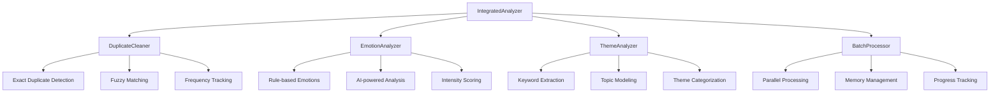

# Integrated Analyzer Documentation

## Overview

The `IntegratedAnalyzer` class provides a unified interface for all analysis tools in the Personal Paraguay Fiber Comments Analysis system. It orchestrates multiple analysis components including duplicate detection, emotion analysis, theme extraction, and batch processing, presenting them through a cohesive Streamlit interface.

---

## Architecture

### Class Structure

```python
class IntegratedAnalyzer:
    """Unified interface for all analysis tools"""
    
    def __init__(self):
        self.duplicate_cleaner = DuplicateCleaner()
        self.emotion_analyzer = EmotionAnalyzer()
        self.theme_analyzer = ThemeAnalyzer()
        self.batch_processor = BatchProcessor()
        self.current_results = {}
        self.processed_df = None
```

### Component Integration



---

## Core Features

### 1. Unified Analysis Interface

The integrated analyzer provides a single entry point for all analysis operations:

```python
def render_analysis_ui(self):
    """Render the analysis tools UI in Streamlit"""
    st.title("🔬 Advanced Analysis Tools")
    
    # Analysis type selection
    analysis_types = st.multiselect(
        "Select Analysis Types",
        [
            "Duplicate Detection", 
            "Emotion Analysis", 
            "Theme Analysis", 
            "Batch Processing"
        ],
        default=["Duplicate Detection", "Emotion Analysis", "Theme Analysis"]
    )
```

**Features:**
- **Multi-select Interface**: Choose which analyses to run
- **Default Configuration**: Sensible defaults for most use cases
- **Real-time Feedback**: Progress indicators and status updates
- **Error Handling**: Graceful handling of analysis failures

### 2. Comprehensive Analysis Pipeline

```python
def run_comprehensive_analysis(self, df: pd.DataFrame, analysis_types: List[str]):
    """Run selected analyses on the dataframe"""
    
    progress_bar = st.progress(0)
    status_text = st.empty()
    total_steps = len(analysis_types)
    current_step = 0
    
    try:
        # Sequential execution with progress tracking
        if "Duplicate Detection" in analysis_types:
            status_text.text("Analyzing duplicates...")
            self.current_results['duplicates'] = self._run_duplicate_analysis(df)
            current_step += 1
            progress_bar.progress(current_step / total_steps)
        
        # Continue with other analyses...
        
    except Exception as e:
        st.error(f"Analysis failed: {str(e)}")
        logger.error(f"Analysis error: {e}", exc_info=True)
```

**Pipeline Stages:**
1. **Input Validation**: Verify data format and requirements
2. **Duplicate Detection**: Identify and handle duplicate comments
3. **Emotion Analysis**: Extract emotional content and intensity
4. **Theme Analysis**: Identify topics and categories
5. **Batch Processing**: Handle large datasets efficiently
6. **Result Aggregation**: Combine results from all analyses
7. **Visualization**: Generate charts and summaries

### 3. Result Management

```python
def display_results(self):
    """Display comprehensive analysis results"""
    
    # Create tabs for different result types
    tabs = st.tabs(["📊 Overview", "🔍 Duplicates", "😊 Emotions", "🏷️ Themes", "⚡ Performance"])
    
    with tabs[0]:  # Overview
        self._display_overview()
    
    with tabs[1]:  # Duplicates
        if 'duplicates' in self.current_results:
            self._display_duplicate_results()
    
    with tabs[2]:  # Emotions
        if 'emotions' in self.current_results:
            self._display_emotion_results()
    
    # ... continue with other tabs
```

---

## Analysis Components

### 1. Duplicate Detection Integration

```python
def _run_duplicate_analysis(self, df: pd.DataFrame) -> Dict:
    """Run duplicate detection analysis"""
    
    try:
        # Configure duplicate cleaner
        cleaner = self.duplicate_cleaner
        
        # Find exact duplicates
        exact_duplicates = cleaner.find_exact_duplicates(df)
        
        # Find fuzzy duplicates
        fuzzy_duplicates = cleaner.find_fuzzy_duplicates(df)
        
        # Clean dataset
        cleaned_df = cleaner.remove_duplicates(df)
        
        return {
            'exact_count': len(exact_duplicates),
            'fuzzy_count': len(fuzzy_duplicates),
            'original_count': len(df),
            'cleaned_count': len(cleaned_df),
            'reduction_percentage': ((len(df) - len(cleaned_df)) / len(df)) * 100,
            'duplicate_examples': exact_duplicates[:5],  # First 5 examples
            'cleaned_data': cleaned_df
        }
        
    except Exception as e:
        logger.error(f"Duplicate analysis failed: {e}")
        return {'error': str(e)}
```

**Duplicate Detection Features:**
- **Exact Matching**: Hash-based detection of identical comments
- **Fuzzy Matching**: Similarity-based detection with configurable threshold
- **Frequency Tracking**: Count occurrences of duplicate comments
- **Smart Cleaning**: Preserve original with highest quality metadata

### 2. Emotion Analysis Integration

```python
def _run_emotion_analysis(self, df: pd.DataFrame) -> Dict:
    """Run emotion analysis on comments"""
    
    try:
        analyzer = self.emotion_analyzer
        
        # Analyze emotions for each comment
        emotion_results = []
        for _, row in df.iterrows():
            comment_text = row.get('Comentario Final', '')
            emotions = analyzer.analyze_emotions(comment_text)
            emotion_results.append(emotions)
        
        # Aggregate results
        df_emotions = pd.DataFrame(emotion_results)
        
        return {
            'emotion_distribution': df_emotions.mean().to_dict(),
            'dominant_emotions': df_emotions.idxmax(axis=1).value_counts().to_dict(),
            'emotion_intensity': df_emotions.sum(axis=1).mean(),
            'detailed_results': emotion_results,
            'top_emotional_comments': self._get_top_emotional_comments(df, df_emotions)
        }
        
    except Exception as e:
        logger.error(f"Emotion analysis failed: {e}")
        return {'error': str(e)}
```

**Emotion Analysis Features:**
- **Multi-dimensional Emotions**: Joy, anger, sadness, fear, surprise, disgust
- **Intensity Scoring**: Quantitative emotional intensity (0-1 scale)
- **Dominant Emotion**: Primary emotion for each comment
- **Aggregated Statistics**: Overall emotional distribution
- **Top Examples**: Comments with strongest emotional content

### 3. Theme Analysis Integration

```python
def _run_theme_analysis(self, df: pd.DataFrame) -> Dict:
    """Run theme analysis to identify topics"""
    
    try:
        analyzer = self.theme_analyzer
        
        # Extract all comment text
        comments = df['Comentario Final'].dropna().tolist()
        
        # Run theme extraction
        themes = analyzer.extract_themes(comments)
        
        # Categorize themes
        categorized_themes = analyzer.categorize_themes(themes)
        
        # Analyze theme evolution over time if dates available
        time_analysis = None
        if 'Fecha' in df.columns:
            time_analysis = analyzer.analyze_theme_trends(df, themes)
        
        return {
            'total_themes': len(themes),
            'themes_by_frequency': sorted(themes.items(), key=lambda x: x[1], reverse=True)[:10],
            'theme_categories': categorized_themes,
            'theme_distribution': self._calculate_theme_distribution(themes),
            'time_trends': time_analysis,
            'word_cloud_data': self._prepare_wordcloud_data(themes)
        }
        
    except Exception as e:
        logger.error(f"Theme analysis failed: {e}")
        return {'error': str(e)}
```

**Theme Analysis Features:**
- **Automatic Theme Extraction**: Identify topics without predefined categories
- **Theme Categorization**: Group related themes into broader categories
- **Frequency Analysis**: Track theme occurrence and importance
- **Temporal Trends**: Analyze how themes evolve over time
- **Word Cloud Generation**: Visual representation of theme importance

### 4. Batch Processing Integration

```python
def _run_batch_processing(self, df: pd.DataFrame) -> Dict:
    """Run batch processing for large datasets"""
    
    try:
        processor = self.batch_processor
        
        # Configure batch settings
        batch_size = min(100, len(df) // 10 + 1)  # Dynamic batch sizing
        
        # Process in batches
        results = processor.process_dataframe(
            df=df,
            batch_size=batch_size,
            analysis_functions=[
                self._batch_sentiment_analysis,
                self._batch_category_prediction,
                self._batch_priority_scoring
            ]
        )
        
        return {
            'batch_count': len(results),
            'total_processed': sum(len(batch) for batch in results),
            'processing_time': processor.get_processing_time(),
            'memory_usage': processor.get_memory_stats(),
            'performance_metrics': processor.get_performance_metrics()
        }
        
    except Exception as e:
        logger.error(f"Batch processing failed: {e}")
        return {'error': str(e)}
```

**Batch Processing Features:**
- **Dynamic Batch Sizing**: Optimal batch sizes based on data size and memory
- **Parallel Processing**: Multi-threaded analysis for improved performance
- **Memory Management**: Efficient handling of large datasets
- **Progress Tracking**: Real-time progress updates and ETA calculation
- **Error Recovery**: Graceful handling of batch failures

---

## Configuration Options

### Analysis Configuration

```python
class AnalysisConfig:
    """Configuration for integrated analysis"""
    
    def __init__(self):
        # Duplicate detection settings
        self.duplicate_threshold = 0.95
        self.exact_matching = True
        self.fuzzy_matching = True
        
        # Emotion analysis settings
        self.emotion_confidence_threshold = 0.7
        self.include_intensity_scoring = True
        self.emotional_categories = ['joy', 'anger', 'sadness', 'fear', 'surprise', 'disgust']
        
        # Theme analysis settings
        self.min_theme_frequency = 2
        self.max_themes = 20
        self.theme_similarity_threshold = 0.8
        
        # Batch processing settings
        self.batch_size = 100
        self.parallel_processing = True
        self.memory_limit_mb = 1024
        
        # UI settings
        self.show_progress = True
        self.enable_caching = True
        self.auto_export_results = False
```

### Performance Tuning

```python
def optimize_performance(self, df_size: int) -> None:
    """Optimize analysis performance based on dataset size"""
    
    if df_size < 100:
        # Small dataset - prioritize speed
        self.batch_processor.batch_size = 10
        self.duplicate_cleaner.use_fast_hashing = True
        
    elif df_size < 1000:
        # Medium dataset - balanced approach
        self.batch_processor.batch_size = 50
        self.emotion_analyzer.enable_caching = True
        
    else:
        # Large dataset - prioritize memory efficiency
        self.batch_processor.batch_size = 100
        self.batch_processor.enable_streaming = True
        self.duplicate_cleaner.use_incremental_processing = True
```

---

## Result Visualization

### 1. Overview Dashboard

```python
def _display_overview(self):
    """Display analysis overview dashboard"""
    
    # Key metrics
    col1, col2, col3, col4 = st.columns(4)
    
    with col1:
        st.metric(
            "Total Comments",
            value=self._get_total_comments(),
            delta=self._get_comment_change()
        )
    
    with col2:
        st.metric(
            "Duplicates Removed",
            value=self._get_duplicates_removed(),
            delta=f"-{self._get_duplicate_percentage()}%"
        )
    
    with col3:
        st.metric(
            "Dominant Emotion",
            value=self._get_dominant_emotion(),
            delta=self._get_emotion_confidence()
        )
    
    with col4:
        st.metric(
            "Top Theme",
            value=self._get_top_theme(),
            delta=f"{self._get_theme_frequency()}%"
        )
    
    # Summary charts
    self._display_summary_charts()
```

### 2. Interactive Visualizations

```python
def _display_emotion_results(self):
    """Display emotion analysis results with interactive charts"""
    
    emotions_data = self.current_results.get('emotions', {})
    
    # Emotion distribution pie chart
    fig_pie = px.pie(
        values=list(emotions_data['emotion_distribution'].values()),
        names=list(emotions_data['emotion_distribution'].keys()),
        title="Emotion Distribution"
    )
    st.plotly_chart(fig_pie, use_container_width=True)
    
    # Emotion intensity radar chart
    fig_radar = go.Figure()
    fig_radar.add_trace(go.Scatterpolar(
        r=list(emotions_data['emotion_distribution'].values()),
        theta=list(emotions_data['emotion_distribution'].keys()),
        fill='toself',
        name='Emotion Intensity'
    ))
    fig_radar.update_layout(title="Emotion Intensity Radar")
    st.plotly_chart(fig_radar, use_container_width=True)
    
    # Top emotional comments
    if 'top_emotional_comments' in emotions_data:
        st.subheader("Most Emotional Comments")
        for comment in emotions_data['top_emotional_comments'][:5]:
            with st.expander(f"Emotion: {comment['dominant_emotion']} (Intensity: {comment['intensity']:.2f})"):
                st.write(comment['text'])
                st.json(comment['emotions'])
```

### 3. Export Capabilities

```python
def export_results(self, format: str = 'excel') -> str:
    """Export analysis results in specified format"""
    
    if not self.current_results:
        raise ValueError("No results to export")
    
    timestamp = datetime.now().strftime("%Y%m%d_%H%M%S")
    
    if format == 'excel':
        filename = f"analysis_results_{timestamp}.xlsx"
        self._export_to_excel(filename)
    elif format == 'json':
        filename = f"analysis_results_{timestamp}.json"
        self._export_to_json(filename)
    elif format == 'csv':
        filename = f"analysis_results_{timestamp}.csv"
        self._export_to_csv(filename)
    else:
        raise ValueError(f"Unsupported export format: {format}")
    
    return filename
```

---

## Error Handling and Recovery

### Error Classification

```python
class AnalysisError(Exception):
    """Base class for analysis errors"""
    pass

class DataValidationError(AnalysisError):
    """Raised when input data is invalid"""
    pass

class ProcessingError(AnalysisError):
    """Raised when analysis processing fails"""
    pass

class MemoryError(AnalysisError):
    """Raised when memory limits are exceeded"""
    pass
```

### Recovery Strategies

```python
def handle_analysis_error(self, error: Exception, analysis_type: str) -> Dict:
    """Handle analysis errors with appropriate recovery strategies"""
    
    if isinstance(error, DataValidationError):
        # Data validation errors - try data cleaning
        return self._attempt_data_cleaning(analysis_type)
    
    elif isinstance(error, MemoryError):
        # Memory errors - reduce batch size and retry
        return self._retry_with_smaller_batches(analysis_type)
    
    elif isinstance(error, ProcessingError):
        # Processing errors - use fallback methods
        return self._use_fallback_analysis(analysis_type)
    
    else:
        # Unknown errors - log and return minimal results
        logger.error(f"Unknown error in {analysis_type}: {error}")
        return {'error': str(error), 'partial_results': self._get_partial_results()}
```

---

## Performance Metrics

### Execution Metrics

```python
def get_performance_metrics(self) -> Dict:
    """Get detailed performance metrics for the analysis"""
    
    return {
        'execution_times': {
            'duplicate_detection': self._get_execution_time('duplicates'),
            'emotion_analysis': self._get_execution_time('emotions'),
            'theme_analysis': self._get_execution_time('themes'),
            'batch_processing': self._get_execution_time('batch')
        },
        'memory_usage': {
            'peak_memory_mb': self._get_peak_memory(),
            'average_memory_mb': self._get_average_memory(),
            'memory_efficiency': self._calculate_memory_efficiency()
        },
        'processing_statistics': {
            'comments_per_second': self._calculate_processing_speed(),
            'cache_hit_rate': self._get_cache_hit_rate(),
            'error_rate': self._calculate_error_rate()
        },
        'quality_metrics': {
            'analysis_confidence': self._calculate_overall_confidence(),
            'data_completeness': self._calculate_data_completeness(),
            'result_consistency': self._check_result_consistency()
        }
    }
```

### Benchmarking

```python
def benchmark_performance(self, test_datasets: List[pd.DataFrame]) -> Dict:
    """Benchmark performance across different dataset sizes"""
    
    results = {}
    
    for i, df in enumerate(test_datasets):
        dataset_name = f"dataset_{i+1}_{len(df)}_comments"
        
        start_time = time.time()
        self.run_comprehensive_analysis(df, ["Duplicate Detection", "Emotion Analysis", "Theme Analysis"])
        end_time = time.time()
        
        results[dataset_name] = {
            'size': len(df),
            'execution_time': end_time - start_time,
            'comments_per_second': len(df) / (end_time - start_time),
            'memory_usage': self._get_memory_usage(),
            'accuracy_metrics': self._calculate_accuracy_metrics()
        }
    
    return results
```

---

## Integration Points

### Streamlit Integration

```python
def integrate_with_streamlit(self, session_state_key: str = 'analysis_results'):
    """Integrate analyzer with Streamlit session state"""
    
    # Initialize session state
    if session_state_key not in st.session_state:
        st.session_state[session_state_key] = {}
    
    # Bind analysis results to session state
    self.session_state_key = session_state_key
    
    # Auto-save results
    if self.current_results:
        st.session_state[session_state_key] = self.current_results
```

### API Integration

```python
def create_api_endpoint(self) -> Dict:
    """Create API-compatible analysis endpoint"""
    
    def analyze_api(request_data: Dict) -> Dict:
        """API endpoint for integrated analysis"""
        
        try:
            # Validate request
            if 'comments' not in request_data:
                raise ValueError("Missing 'comments' field in request")
            
            # Convert to DataFrame
            df = pd.DataFrame(request_data['comments'])
            
            # Run analysis
            analysis_types = request_data.get('analysis_types', ['Duplicate Detection', 'Emotion Analysis', 'Theme Analysis'])
            self.run_comprehensive_analysis(df, analysis_types)
            
            # Return results
            return {
                'status': 'success',
                'results': self.current_results,
                'metadata': self.get_performance_metrics()
            }
            
        except Exception as e:
            return {
                'status': 'error',
                'error': str(e),
                'partial_results': self.current_results
            }
    
    return analyze_api
```

---

## Testing and Validation

### Unit Tests

```python
def test_integrated_analyzer():
    """Test suite for integrated analyzer"""
    
    # Test initialization
    analyzer = IntegratedAnalyzer()
    assert analyzer.duplicate_cleaner is not None
    assert analyzer.emotion_analyzer is not None
    assert analyzer.theme_analyzer is not None
    assert analyzer.batch_processor is not None
    
    # Test with sample data
    sample_df = pd.DataFrame({
        'Comentario Final': [
            'Excelente servicio',
            'Muy malo el servicio',
            'Excelente servicio',  # Duplicate
            'Regular atención'
        ]
    })
    
    # Test duplicate detection
    analyzer.run_comprehensive_analysis(sample_df, ['Duplicate Detection'])
    assert 'duplicates' in analyzer.current_results
    assert analyzer.current_results['duplicates']['exact_count'] == 1
    
    # Test emotion analysis
    analyzer.run_comprehensive_analysis(sample_df, ['Emotion Analysis'])
    assert 'emotions' in analyzer.current_results
    assert 'emotion_distribution' in analyzer.current_results['emotions']
```

### Integration Tests

```python
def test_full_integration():
    """Test complete integration workflow"""
    
    # Load test data
    test_df = load_test_data('customer_comments_sample.xlsx')
    
    # Initialize analyzer
    analyzer = IntegratedAnalyzer()
    
    # Run full analysis
    analyzer.run_comprehensive_analysis(
        test_df, 
        ['Duplicate Detection', 'Emotion Analysis', 'Theme Analysis', 'Batch Processing']
    )
    
    # Validate results
    assert len(analyzer.current_results) == 4
    assert all(key in analyzer.current_results for key in ['duplicates', 'emotions', 'themes', 'batch'])
    
    # Test export functionality
    export_file = analyzer.export_results('excel')
    assert os.path.exists(export_file)
    
    # Validate performance
    metrics = analyzer.get_performance_metrics()
    assert metrics['processing_statistics']['comments_per_second'] > 1.0
```

---

## Best Practices

### 1. Data Preparation
- Validate input data format before analysis
- Handle missing values appropriately
- Normalize text encoding (UTF-8)
- Remove or flag suspicious entries

### 2. Performance Optimization
- Use appropriate batch sizes for dataset size
- Enable caching for repeated analyses
- Monitor memory usage during processing
- Implement parallel processing for independent analyses

### 3. Error Handling
- Implement graceful degradation for failed analyses
- Provide meaningful error messages to users
- Log detailed error information for debugging
- Offer alternative analysis methods when primary methods fail

### 4. Result Interpretation
- Provide confidence scores for all analyses
- Include sample data to illustrate findings
- Offer multiple visualization options
- Enable drill-down into detailed results

### 5. User Experience
- Show real-time progress indicators
- Provide clear status messages
- Enable cancellation of long-running analyses
- Offer export options in multiple formats

---

## Future Enhancements

### Planned Features
1. **Machine Learning Integration**: Custom ML models for domain-specific analysis
2. **Real-time Processing**: Streaming analysis for live data feeds
3. **Advanced Visualizations**: Interactive dashboards with drill-down capabilities
4. **Multi-language Support**: Enhanced support for Guaraní and other languages
5. **API Expansion**: RESTful API for programmatic access
6. **Custom Analysis Plugins**: Framework for user-defined analysis modules

### Performance Improvements
1. **GPU Acceleration**: Leverage GPU for large-scale text processing
2. **Distributed Processing**: Multi-node processing for enterprise datasets
3. **Advanced Caching**: Intelligent caching with automatic invalidation
4. **Memory Optimization**: Streaming algorithms for memory-constrained environments

---

## Troubleshooting

### Common Issues

#### "Analysis Failed" Error
**Symptoms**: Analysis stops with generic error message
**Causes**: 
- Invalid data format
- Memory exhaustion
- Missing dependencies

**Solutions**:
1. Validate input data format
2. Check available memory
3. Reduce batch size
4. Update dependencies

#### "Slow Performance" Issue
**Symptoms**: Analysis takes excessive time
**Causes**:
- Large dataset size
- Inefficient configuration
- Resource constraints

**Solutions**:
1. Enable parallel processing
2. Increase batch size
3. Use data sampling for testing
4. Optimize system resources

#### "Inconsistent Results" Problem
**Symptoms**: Different results on repeated runs
**Causes**:
- Non-deterministic algorithms
- Data ordering changes
- Caching issues

**Solutions**:
1. Set random seeds
2. Sort data consistently
3. Clear cache between runs
4. Use deterministic algorithms

---

## Support and Documentation

### Getting Help
- **User Manual**: Comprehensive user guide
- **API Documentation**: Technical reference
- **Video Tutorials**: Step-by-step demonstrations
- **Community Forum**: User discussions and Q&A
- **Support Email**: Direct technical support

### Contributing
- **Bug Reports**: Report issues via GitHub
- **Feature Requests**: Suggest improvements
- **Code Contributions**: Submit pull requests
- **Documentation**: Help improve documentation
- **Testing**: Contribute test cases and data